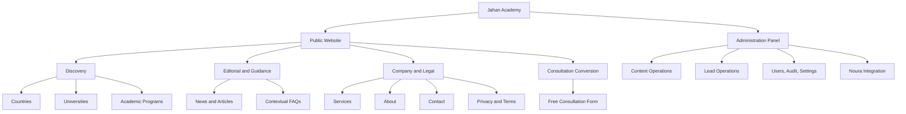
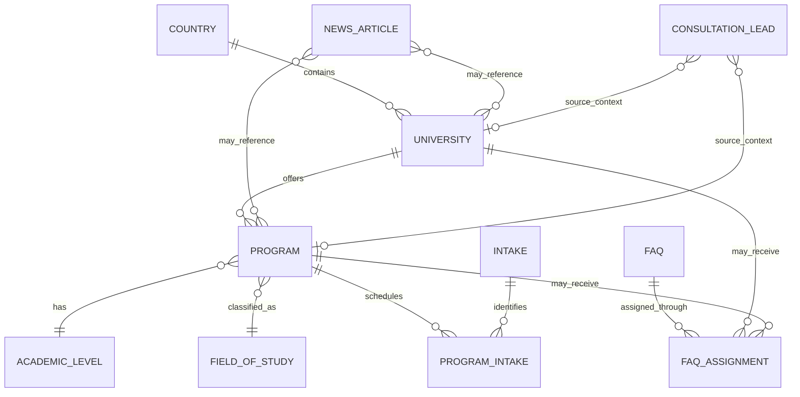

# Jahan Academy — Information Architecture

> **Version:** 1.0
> **Scope:** MVP v1
> **Date:** September 22, 2026
> **Source of truth:** [PROJECT_CONTEXT.md](./PROJECT_CONTEXT.md)
> **SRS:** [SRS.md](./SRS.md)
> **User journeys:** [USER_JOURNEYS.md](./USER_JOURNEYS.md)

## 1. Purpose

This document defines how Jahan Academy information is grouped, labeled, related, navigated, and exposed across the public website and administration panel. It is the implementation reference for route structure, menus, page hierarchy, content relationships, discovery, and role-based panel visibility.

## 2. IA Principles

1. **Consultation is the primary outcome.** Every major discovery path leads naturally to a free-consultation CTA.
2. **Browse without registration.** Public information and consultation remain accessible to guests in MVP.
3. **Entity-first discovery.** Countries, universities, Programs, and articles have stable canonical pages.
4. **Two-language parity.** Persian and English have equivalent hierarchy, content, and functionality.
5. **Shared stable URLs.** Both locales use the same English route segments and shared entity slugs under explicit locale prefixes.
6. **Context is preserved.** Consultation opened from a university or Program keeps trusted source context.
7. **Tasks determine admin structure.** Panel sections follow content, lead, integration, and governance workflows rather than database tables alone.
8. **Progressive disclosure.** Lists show comparison-ready summaries; detail pages expose complete verified information.
9. **No orphan content.** Published entities are reachable through navigation, relationships, internal links, search, or sitemap.
10. **MVP boundaries are visible.** Account, Application, payment, booking, LMS, and document workflows are absent from MVP navigation.

## 3. High-Level System Map



## 4. Public Website Architecture

### 4.1 Public sitemap

```text
/{locale}
├── Home
├── Countries
│   ├── Country listing
│   └── Country detail
│       ├── Overview and guidance
│       ├── Related universities
│       ├── Related Programs
│       └── Consultation CTA
├── Universities
│   ├── University listing and search
│   └── University detail
│       ├── Overview
│       ├── Facts and location
│       ├── Media
│       ├── Published Programs
│       ├── FAQs
│       ├── Related news
│       └── Contextual consultation CTA
├── Programs
│   ├── Program listing
│   │   ├── Search
│   │   ├── Level filter
│   │   ├── Field filter
│   │   ├── Intake filter
│   │   ├── Sort
│   │   └── Pagination
│   └── Program detail
│       ├── Overview
│       ├── University relationship
│       ├── Level and field
│       ├── Tuition and application fee
│       ├── Duration and teaching language
│       ├── Intakes and deadlines
│       ├── Admission requirements
│       ├── Official source
│       ├── FAQs
│       └── Contextual consultation CTA
├── News and Articles
│   ├── News listing
│   └── Article detail
│       ├── Article content
│       ├── Author and date
│       ├── Related/latest articles
│       └── Relevant consultation CTA
├── Services
├── About
├── Contact
├── Free Consultation
├── Privacy Policy
├── Terms and Conditions
└── System Pages
    ├── 404 Not Found
    └── General Error
```

`{locale}` is always `fa` or `en`.

### 4.2 Canonical public routes

| Page type | Route pattern | Indexability | Primary purpose |
|---|---|---|---|
| Homepage | `/{locale}` | Index | Orientation and primary conversion |
| Country list | `/{locale}/countries` | Index | Destination discovery |
| Country detail | `/{locale}/countries/{slug}` | Index when Published | Country overview and related entities |
| University list | `/{locale}/universities` | Index without arbitrary filters | Search and browse universities |
| University detail | `/{locale}/universities/{slug}` | Index when Published | Evaluate an institution and its Programs |
| Program list | `/{locale}/programs` | Index without arbitrary filters | Search/filter/sort academic Programs |
| Program detail | `/{locale}/programs/{slug}` | Index when Published | Evaluate a specific Program |
| News list | `/{locale}/news` | Index | Browse editorial content |
| Article detail | `/{locale}/news/{slug}` | Index when Published | Inform and build trust |
| Services | `/{locale}/services` | Index | Explain available services |
| About | `/{locale}/about` | Index | Establish organizational trust |
| Contact | `/{locale}/contact` | Index | Show contact information and allowed contact action |
| Consultation | `/{locale}/consultation` | Index unless SEO strategy later changes | Capture free-consultation requests |
| Privacy | `/{locale}/privacy` | Index | Explain personal-data processing |
| Terms | `/{locale}/terms` | Index | Explain service terms |
| 404 | locale-aware framework route | Noindex | Recovery from missing URL |
| General error | locale-aware error boundary | Noindex | Safe recovery from unexpected error |

### 4.3 URL conventions

- Route segments and entity slugs are lowercase English and hyphen-separated.
- Entity slugs are shared between Persian and English.
- Locale is never inferred silently; both languages use an explicit prefix.
- Listing query parameters use stable English machine names.
- Empty/default values are omitted from URLs.
- Changing search, filters, or sort resets `page` to `1`.
- Unknown query values are ignored safely.
- Canonical URLs exclude non-content parameters and arbitrary filter combinations.

Recommended Program list query model:

```text
/{locale}/programs?q={text}&level={code}&field={slug}&intake={code}&sort={value}&page={number}
```

Recommended university list query model:

```text
/{locale}/universities?q={text}&page={number}
```

Approved sort values:

- `title-asc`
- `tuition-asc`
- `tuition-desc`

### 4.4 Primary navigation

Recommended desktop order follows the reading direction while retaining the same conceptual order:

1. Home
2. Countries
3. Services
4. Universities
5. News / Articles
6. About
7. Contact

Persistent utilities:

- Search/discovery access.
- Language switcher.
- Primary `Request Free Consultation` CTA.

On mobile, these items move into an accessible collapsible menu. The consultation CTA remains prominent without requiring excessive scrolling.

### 4.5 Footer architecture

| Group | Links/content |
|---|---|
| Discovery | Countries, Universities, Programs |
| Information | Services, News/Articles, About, Contact |
| Support | Free Consultation, FAQ entry points where applicable |
| Legal | Privacy Policy, Terms and Conditions |
| Organization | Approved logo, concise brand statement, verified contact information |
| Locale/social | Language switcher and approved social links only |

The footer shall not advertise Post-MVP functionality as available.

### 4.6 Homepage information hierarchy

Recommended page order:

1. Header and primary navigation.
2. Hero with value proposition and primary consultation CTA.
3. Direct university/Program discovery entry.
4. Featured destinations.
5. Services and value proposition.
6. Featured universities or Programs when configured.
7. Trust/benefit section using only verified claims.
8. Latest articles/news.
9. FAQs when configured.
10. Consultation block.
11. Footer.

The page may adapt section visibility to available approved content, but discovery and consultation must remain prominent.

### 4.7 Listing-page information hierarchy

#### University listing

1. Breadcrumb and H1.
2. Introductory copy when approved.
3. Name search.
4. Result count and pagination state.
5. Result cards/list.
6. Loading, empty, retry, and pagination controls.
7. Consultation CTA.

#### Program listing

1. Breadcrumb and H1.
2. Search and selected-filter summary.
3. Desktop filter rail or toolbar; mobile filter drawer/sheet.
4. Active removable filter chips and reset.
5. Result count, sort, and display controls if approved.
6. Program results.
7. Loading, empty, retry, and pagination controls.
8. Consultation CTA.

Program cards should expose only decision-supporting summary fields:

- Program title.
- University.
- Country/city where useful.
- Academic level and field.
- Tuition summary.
- Duration and/or intake when available.
- Detail action.

### 4.8 Detail-page information hierarchy

#### University detail

1. Breadcrumb.
2. University identity: name, logo, hero/media, city/country, type.
3. Primary contextual consultation action.
4. Overview and verified facts.
5. Official website/contact where supplied.
6. Published Programs.
7. Assigned FAQs.
8. Related news.
9. Repeated consultation block near the end.

#### Program detail

1. Breadcrumb.
2. Program identity and linked university.
3. High-value summary: level, field, duration, language, tuition.
4. Primary contextual consultation action.
5. Intakes and deadlines.
6. Application fee.
7. Admission requirements.
8. Full bilingual description.
9. Official source link.
10. Assigned FAQs.
11. Related Program/university navigation where approved.
12. Repeated consultation block.

#### Article detail

1. Breadcrumb.
2. Title, summary, author, publication date, featured image.
3. Semantic article body.
4. Contextual links to countries, universities, or Programs where editorially relevant.
5. Related/latest articles.
6. Relevant consultation CTA.

### 4.9 Consultation information architecture

The consultation form is available as:

- A dedicated route.
- A homepage section or linked block.
- A contextual action from university detail.
- A contextual action from Program detail.
- A global header/mobile CTA.
- An editorial CTA where relevant.

Form field grouping:

| Group | Fields |
|---|---|
| Contact identity | First name, last name, required mobile, optional email |
| Study intent | Desired country, intake term, start year |
| Qualification context | Optional age, gender, occupation, marital status |
| Financial context | Optional investment/budget range and currency |
| Additional context | Optional message |
| Source context | Trusted page URL and optional university/Program identifiers; displayed read-only where useful |
| Consent | Required privacy and contact consent with policy links |

Form sequence:

1. Short localized introduction.
2. Source context when present.
3. Two-column desktop / one-column mobile field grid.
4. Full-width optional message.
5. Consent.
6. Full-width primary submit action.
7. Validation summary/field errors or success/reference state.

## 5. Content Model and Relationships

### 5.1 Primary content types

| Content type | Purpose | Lifecycle | Translatable |
|---|---|---|---|
| Country | Destination organization and discovery | Draft / Published / Archived | Labels and content |
| City/location | University location reference | Managed/active as implemented | Label |
| University | Institution profile | Draft / Published / Archived | Name, descriptions, SEO, media alt text |
| Program | Academic offering | Draft / Published / Archived | Title, descriptions, requirements, SEO |
| Academic level | Program taxonomy | Managed/active | Label |
| Field of study | Program taxonomy | Managed/active | Label |
| Intake | Program term taxonomy | Managed/active | Label |
| Currency | Tuition/application-fee/budget representation | Managed/active | Display formatting |
| News article | Editorial acquisition and guidance | Draft / Published / Archived | Full content and SEO |
| FAQ | Reusable contextual guidance | Draft / Published / Archived | Question and answer |
| Static page | Services/company/legal content | Draft / Published / Archived or managed singleton | Full content and SEO |
| Media asset | Shared image/file metadata | Active/archived as implemented | Alt text where exposed |
| Consultation lead | Operational conversion record | Operational statuses plus archive/anonymize | Locale-neutral data with source locale |

### 5.2 Relationship map



Key cardinality rules:

- Each university belongs to exactly one country.
- Each Program belongs to exactly one university.
- A Program can have multiple intake records.
- A reusable FAQ can be assigned to one or more supported target types.
- A consultation lead can reference no entity, one university, or one Program plus its university.
- Relationships to Archived content remain internally valid even when public navigation is removed.

### 5.3 Taxonomy governance

- Codes are stable, English, and locale-neutral.
- Display labels are bilingual.
- Taxonomy records referenced by Published or operational data are deactivated/archived rather than destructively deleted.
- Academic level, field, intake, currency, gender, marital status, and budget-range option sets are centrally managed or versioned configuration.

## 6. Search and Discovery Architecture

### 6.1 MVP search boundaries

- University search operates on the active-language university name.
- Program search operates on the active-language Program title.
- Search is case-insensitive and locale-aware.
- Site-wide federated search is not required unless separately approved; header search may route users to the appropriate discovery experience.

### 6.2 Filter architecture

MVP Program filters:

- Academic level.
- Field of study.
- Intake.

Advanced filters such as city, institution type, teaching language, duration, application fee, scholarship, ranking, and budget are Post-MVP.

### 6.3 SEO discovery behavior

- Canonical unfiltered listings may be indexable.
- Arbitrary query/filter combinations are `noindex,follow` and canonicalize to the base list.
- Published entity and article pages appear in XML sitemaps.
- Archived/Draft content is excluded.
- Reciprocal hreflang connects Persian and English equivalents.

## 7. Administration Panel Architecture

### 7.1 Admin route root

All panel routes are under `/admin`. The panel does not use the public `/fa` or `/en` URL structure; bilingual content editing is handled inside entity forms.

### 7.2 Admin sitemap

```text
/admin
├── Sign in
├── Forgot / Reset Password
└── Authenticated Panel
    ├── Dashboard
    ├── Leads
    │   ├── All Leads
    │   ├── My Assigned Leads
    │   ├── Failed Noura Sync
    │   ├── Archived Leads
    │   └── Lead Detail
    │       ├── Overview and contact
    │       ├── Qualification data
    │       ├── Notes
    │       ├── Status history
    │       ├── Assignment history
    │       ├── Noura synchronization
    │       └── Audit events where authorized
    ├── Discovery Content
    │   ├── Countries
    │   ├── Cities / Locations
    │   ├── Universities
    │   └── Programs
    ├── Editorial Content
    │   ├── News / Articles
    │   ├── FAQs
    │   └── Static Pages
    ├── Media Library
    ├── Taxonomies
    │   ├── Academic Levels
    │   ├── Fields of Study
    │   ├── Intakes
    │   ├── Currencies
    │   ├── Gender Options
    │   ├── Marital-status Options
    │   └── Budget Ranges
    ├── SEO and Navigation
    │   ├── Global SEO Defaults
    │   ├── Navigation / Footer
    │   └── Sitemap Status
    ├── Integrations
    │   └── Noura Queue and Failures
    ├── Team and Access
    │   ├── Admin Users
    │   └── Role Assignments
    ├── Audit Logs
    └── Settings
        ├── Organization / Contact
        ├── Site / Locale
        ├── Consultation Configuration
        └── Feature Flags where implemented
```

Menu items are permission-filtered for usability, but every route and query remains server-authorized.

### 7.3 Admin primary navigation

Recommended sidebar order:

1. Dashboard.
2. Leads.
3. Discovery Content.
4. Editorial Content.
5. Media.
6. Taxonomies.
7. SEO and Navigation.
8. Integrations.
9. Team and Access.
10. Audit Logs.
11. Settings.

Lower-frequency governance items appear later; daily lead and content tasks remain near the top.

### 7.4 Role-based section visibility

| Admin section | Super Admin | Content Editor | Support | Consultant |
|---|:---:|:---:|:---:|:---:|
| Dashboard | Full | Content summary | Lead summary | Assigned-lead summary |
| All leads | Full | No | Full | No |
| My assigned leads | Full | No | As applicable | Full |
| Lead detail/edit | Full | No | Full | Assigned only; limited operations |
| Assign/reassign | Yes | No | Yes | No |
| Noura manual retry | Yes | No | Yes | No |
| Countries/universities/Programs | Full | Full | Read only only if explicitly needed; default No | No |
| News/FAQs/static pages | Full | Full | No | No |
| Media/taxonomies/SEO | Full | Full | No | No |
| Team and access | Full | No | No | No |
| Complete audit logs | Full | No | No | No |
| Settings | Full | Limited only if explicitly granted; default No | No | No |

### 7.5 Dashboard information hierarchy

Dashboard content is role-specific.

#### Super Admin

- New/unassigned/failed-sync lead counts.
- Recent operational activity.
- Content status/completeness warnings.
- Noura queue health.
- System/backup/monitoring links when available.

#### Content Editor

- Draft/incomplete content.
- Recently updated/published content.
- Missing translations or SEO metadata.
- Quick-create actions.

#### Support

- New and unassigned leads.
- Leads awaiting contact.
- Failed Noura synchronization.
- Recently reassigned or stale leads.

#### Consultant

- Assigned open leads.
- Leads awaiting follow-up.
- Recent notes/status activity.

Dashboard metrics are operational summaries, not the Post-MVP executive reporting system.

### 7.6 Lead list architecture

Default columns:

- Public reference.
- Applicant name.
- Normalized/display mobile.
- Desired country.
- Intake/year.
- Operational status.
- Assigned consultant.
- Noura sync status.
- Source type.
- Created time.
- Last activity time when available.

Filters:

- Search by permitted identifying/reference fields.
- Operational status.
- Assigned consultant.
- Noura sync status.
- Created date range.
- Source entity/type when useful.
- Archived/non-archived.

The default result set is paginated and ordered newest first. Page size is bounded to 100 or less.

### 7.7 Lead detail architecture

Recommended sections:

1. **Header:** public reference, operational status, sync status, assignee, created/updated time.
2. **Contact:** name, mobile, optional email, consent evidence.
3. **Study intent:** country, intake, start year.
4. **Qualification:** age, gender, occupation, marital status, investment/budget; withheld/unknown values shown neutrally.
5. **Source context:** locale, page URL, university, Program.
6. **Message:** applicant-provided context.
7. **Actions:** permitted status update, assignment, note, archive/anonymize, manual retry.
8. **History:** status and assignment timeline.
9. **Noura:** provider state, external ID, attempts/timestamps, sanitized last error.
10. **Audit:** authorized event view.

Operational status and Noura sync status must never be merged into one field or visual control.

### 7.8 Content list architecture

Common list columns:

- Localized primary label/title.
- Entity relationship summary.
- Lifecycle status.
- Persian completeness.
- English completeness.
- SEO completeness.
- Featured/order where supported.
- Updated time and actor.
- Contextual actions.

Common filters:

- Text search.
- Lifecycle status.
- Translation completeness.
- Relationship/taxonomy filters relevant to the entity.
- Featured state where supported.

### 7.9 Content editor form architecture

Recommended form sections or tabs:

1. **General:** shared slug, relationships, stable machine fields, lifecycle status.
2. **Persian:** all Persian content and RTL preview.
3. **English:** all English content and LTR preview.
4. **Structured data:** entity-specific facts, tuition, intake, deadline, fees, taxonomy.
5. **Media:** logo, hero, gallery, featured image, localized alt text, attribution.
6. **Relations:** related Programs, FAQs, news, assignments/order.
7. **SEO:** title, description, social image/fields, canonical preview, structured-data eligibility.
8. **Publish:** completeness checklist, preview, publish/archive action.

Tabs do not hide validation. A publish attempt must summarize missing fields across all sections/locales and link directly to each problem.

### 7.10 Noura integration architecture

The integration section exposes operational metadata only:

- Lead reference.
- Sync state.
- Attempt count.
- Next/last attempt.
- Synced time.
- External Noura ID when present.
- Sanitized error category/message.
- Authorized manual-retry action.

Credentials, access tokens, raw secret-bearing payloads, and detailed provider stack traces are never displayed.

### 7.11 Audit-log architecture

Search/filter dimensions:

- Actor.
- Action category.
- Entity type/ID.
- Date/time range.
- Request/correlation ID when available.

Audit entries expose only safe, redacted before/after differences. They are immutable through the UI and visible in full only to Super Admin.

## 8. Navigation and Cross-Linking Rules

- Breadcrumbs appear on nested public content and match `BreadcrumbList` structured data.
- Country pages link to their Published universities and Programs.
- University pages link to their country and Published Programs.
- Program pages link to their university and, through it, the country.
- Articles may link to relevant entities when editorially justified.
- Contextual consultation CTAs carry trusted identifiers rather than relying on display text.
- Archived/unpublished entities are removed from public relationship lists and sitemaps.
- Admin list/detail pages provide breadcrumbs or stable back-to-list navigation that preserves safe filter state.
- Destructive or lifecycle actions are not placed in primary navigation.

## 9. UI State Requirements by Page Type

| Page type | Required states |
|---|---|
| Public list | Initial loading, populated, empty, filtered empty, recoverable error, pagination boundary |
| Public detail | Loading/render, Published, missing/404, Archived policy, recoverable dependent-content failure |
| Consultation form | Initial, client validation, server validation, in-flight, success/reference, duplicate success, recoverable error |
| Admin list | Loading, populated, empty, filtered empty, permission denied, recoverable error |
| Admin form | Clean, dirty, validating, saving, saved, validation failure, conflict/error, unsaved-navigation warning |
| Authentication | Initial, invalid credentials, locked, reset requested, reset expired/used, successful authentication |
| Integration | Pending, processing where represented, retry scheduled, Synced, Failed, manual retry queued |

## 10. Responsive Architecture

### Public

- Desktop navigation becomes an accessible menu on narrow screens.
- Listing filter rail becomes a drawer/sheet on mobile.
- Cards reduce columns without hiding required decision information.
- Consultation changes from two columns to one while retaining logical field order.
- Tables should become accessible cards or horizontally constrained views only where unavoidable; the public site should not require horizontal scrolling.

### Admin

- Sidebar collapses into a labeled drawer.
- High-priority actions remain reachable without relying on hover.
- Dense lead/content tables may use responsive column priority, row detail expansion, or cards.
- Critical identifiers, statuses, and primary row action remain visible.
- Mobile panel support enables urgent operational actions but does not require matching desktop density.

## 11. Accessibility and Labeling

- Navigation landmarks, headings, breadcrumbs, lists, forms, and status messages use semantic structure.
- Labels remain visible; placeholders provide examples only.
- Icons have text labels or accessible names and are not the only status indicator.
- RTL/LTR mirroring preserves logical reading and keyboard order.
- Validation describes how to correct the input.
- Status names have localized text but stable English machine codes.
- Color is never the only means of communicating lifecycle, lead, or sync status.

## 12. Analytics and IA Events

Subject to approved analytics and consent configuration, the IA should support non-PII events for:

- Primary/secondary navigation selection.
- Locale switch success/failure.
- Search and safe filter categories.
- Result-to-detail navigation.
- Entity-to-consultation CTA.
- Form start, safe validation category, submission, and duplicate result.
- Empty-result recovery action.
- Admin lead assignment/status/sync actions through audit data rather than marketing analytics.

## 13. Post-MVP Reserved Architecture

The following routes/sections are reserved conceptually and must not appear as functioning MVP navigation:

```text
/{locale}/account
├── Profile and onboarding
├── Preferences
├── Favorites
├── Comparisons
├── Documents
├── Applications
├── Notifications
└── Security and linked identities

/admin
├── Applications
├── Applicant document review
├── Public users
├── Bookings and calendar
├── Payments and financial reporting
├── Courses / LMS
└── Advanced reporting
```

Student, Applicant, and General User will share one future authorization role, `User`; navigation personalization will be based on profile and Application state.

## 14. IA Acceptance Checklist

- [ ] Every public page is reachable under `/fa` and `/en` using the same shared entity slug.
- [ ] Header, mobile menu, footer, breadcrumbs, and CTA labels are consistent.
- [ ] No Published country, university, Program, article, or legal page is unintentionally orphaned.
- [ ] Search/filter/sort/page state is stable, shareable, safe, and recoverable.
- [ ] Arbitrary filter pages follow the approved noindex/canonical policy.
- [ ] University and Program relationships are visible and navigable.
- [ ] Consultation source context survives navigation and submission.
- [ ] Admin navigation matches role permissions and daily task priority.
- [ ] Consultants cannot discover or access unassigned lead information.
- [ ] Content forms clearly separate shared fields, Persian, English, structured data, media, relations, and SEO.
- [ ] Publication completeness is visible and enforced across sections.
- [ ] Lead operational status and Noura sync status remain separate.
- [ ] All list/form/detail page types include required loading, empty, error, success, and permission states.
- [ ] Post-MVP routes and controls are not presented as available in MVP.

## 15. Change Control

Changes to routes, navigation labels, content types, relationships, permissions, indexing behavior, or collected consultation data must first be approved in `PROJECT_CONTEXT.md`. The change must then update this document, `SRS.md`, `USER_JOURNEYS.md`, API/schema documentation, redirects where necessary, and affected automated tests.
