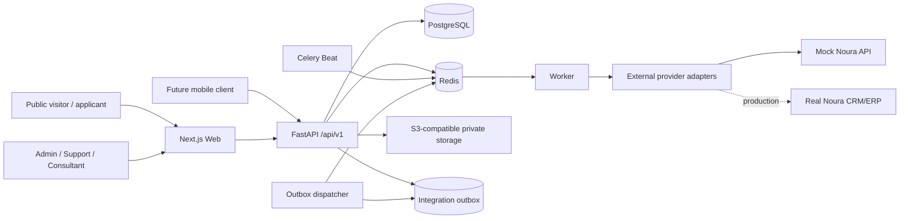

# Jahan Academy

> **Project Source of Truth**
>
> This document is the canonical reference for product scope, requirements, business rules, architecture, data contracts, implementation standards, and delivery status. If another artifact conflicts with this document, this document controls unless the conflict is explicitly resolved and recorded here.

## Document Governance

- **Requirements baseline:** MVP v1
- **Baseline date:** September 22, 2026
- **Target delivery window:** 21–28 Mehr 1405
- **Product owner/developer:** The project owner, implementing the product with Codex assistance
- **Change rule:** A requirement is changed only when the approved decision is recorded in this file.
- **Software Requirements Specification:** [SRS.md](./SRS.md)
- **User journeys:** [USER_JOURNEYS.md](./USER_JOURNEYS.md)
- **Information architecture:** [INFORMATION_ARCHITECTURE.md](./INFORMATION_ARCHITECTURE.md)
- **UX page specifications:** [UX_PAGE_SPECIFICATIONS.md](./UX_PAGE_SPECIFICATIONS.md)
- **Design system:** [DESIGN_SYSTEM.md](./DESIGN_SYSTEM.md)
- **Selected technology stack:** [TECH_STACK.md](./TECH_STACK.md)
- **System architecture:** [SYSTEM_ARCHITECTURE.md](./SYSTEM_ARCHITECTURE.md)
- **Database design and entity catalog:** [DATABASE_DESIGN.md](./DATABASE_DESIGN.md)
- **Database implementation and migration baseline:** [DATABASE_IMPLEMENTATION.md](./DATABASE_IMPLEMENTATION.md)
- **Technology stack comparison:** [TECH_STACK_COMPARISON.md](./TECH_STACK_COMPARISON.md)
- **Research evidence:** [COMPETITOR_ANALYSIS.md](./COMPETITOR_ANALYSIS.md)
- **Design references:** [design-references](./design-references/)
- **Priority notation:** `P0` is required for MVP acceptance, `P1` should be included when it does not threaten P0 delivery, and `Post-MVP` is explicitly outside the first release.

## 1. Product Overview

Jahan Academy is a bilingual educational-migration platform for people between 18 and 40 years old who intend to study abroad, apply to universities, immigrate through education, or develop their educational and career paths.

The MVP is a public discovery and lead-generation website. Users explore universities and academic programs, read bilingual news and guidance, and submit a free-consultation request. The operational team qualifies and manages those requests in the website administration panel and synchronizes them with the Noura CRM/ERP.

The MVP is **not** an ApplyBoard-style transactional application platform. Public user accounts, document upload, application tracking, payments, LMS capabilities, and calendar-based consultation booking are Post-MVP.

### 1.1 MVP North-Star Action

The primary conversion is a successfully submitted **free-consultation request**. The main site-wide CTA is `Request Free Consultation` / `درخواست مشاوره رایگان`.

### 1.2 Geographic and Language Scope

- Users may be located inside or outside Iran.
- Persian is fully RTL and English is fully LTR.
- Both locales use explicit URL prefixes: `/fa/...` and `/en/...`.
- Public content may be published only when both Persian and English versions are complete.

### 1.3 Competitive Landscape

Research completed on September 22, 2026 covers GO2TR, Visa Mondial, Apply For Free, Apply Home, Apply Comma, and MyArman. The approved product implications are:

- Keep one dominant consultation CTA across the public site.
- Use short, low-friction lead capture instead of a long initial assessment.
- Keep the conversion journey inside the platform rather than making a messenger the primary funnel.
- Show clear university and program information with strong search, filter, empty, loading, and error states.
- Treat pricing, online booking, payments, student accounts, and application tracking as later capabilities.

## 2. Business Goals

### 2.1 MVP Goals

1. Generate qualified free-consultation leads.
2. Help users discover relevant universities and academic programs.
3. Build trust through accurate bilingual content, transparent information, and a professional experience.
4. Give the internal team a reliable panel for lead assignment, follow-up, and Noura synchronization.
5. Establish a technically sound SEO foundation for organic acquisition.

### 2.2 Longer-Term Goals

- Receive and manage full university applications.
- Enable paid consultation booking.
- Sell educational courses and services.
- Operate an LMS for recorded and live learning.
- Publish campaigns, webinars, newsletters, testimonials, and automated landing pages.
- Support marketing attribution, experimentation, and advanced funnel reporting.

### 2.3 Initial Success Metrics

- Consultation CTA click-through rate.
- Consultation form start and completion rates.
- Valid lead rate and duplicate lead rate.
- Lead-to-qualified and lead-to-converted rates.
- Median time from lead creation to first contact.
- Noura synchronization success rate and retry recovery rate.
- Organic entrances to university, program, and news pages.
- Search zero-result rate.

Targets are not yet approved. The system must collect the operational data required to establish baselines after launch.

## 3. Target Users

- Students
- Graduates
- Prospective educational immigrants
- University applicants
- General users interested in educational or career development
- Consultants
- Support staff
- Content editors
- Administrators

The primary public-user age range is 18 to 40 years old.

## 4. User Roles

### 4.1 Public Personas

Public personas do not have separate system accounts in the MVP.

- **Visitor:** Browses bilingual pages, universities, programs, and news; searches and filters; submits a consultation request.
- **Prospective Student/Applicant:** A visitor whose main intent is university/program discovery and consultation.
- **Graduate/Educational Immigrant:** A visitor seeking postgraduate study, migration, or career-development guidance.

In Post-MVP, Student, Applicant, and General User are **not** separate authorization roles. They all use one system role, `User`; their intent and experience are determined from profile attributes, onboarding answers, saved preferences, and application state.

### 4.2 Administrative Roles

| Role | Core access |
|---|---|
| **Super Admin** | Full system configuration, admin users, roles, all content, all leads, assignments, Noura retries, SEO, audit logs, and archival/deletion controls |
| **Content Editor** | Create, edit, publish, archive, and manage bilingual universities, programs, countries, news, FAQs, media, and SEO metadata |
| **Support** | View and edit all consultation requests, perform initial contact, assign/reassign a consultant, update status, add notes, and manually retry failed Noura syncs |
| **Consultant** | View only leads assigned to them, record consultation/contact results, add internal notes, and update allowed lead statuses |

### 4.3 Access Principles

- Public users have no account in the MVP. A unified `User` account is planned for Post-MVP.
- Every administrative request is server-authorized; hiding UI controls is not authorization.
- Consultants cannot access unassigned leads.
- Only Super Admin can manage admin users and permissions or inspect complete audit logs.
- Content Editors may publish directly without a separate approval step.

### 4.4 Authorization Matrix Status

The server-side authorization framework uses RBAC, scoped role grants, and domain-owned resource
policies with deny-by-default behavior. The detailed Role → Permission → Scope matrix for the final
product will be approved later. Existing MVP role behaviors remain minimum requirements, but
Student, Customer, Applicant, Instructor, Sales, Admin, and other future labels shall not receive
technical grants merely from their names. `AUTHORIZATION_DESIGN.md` is the matrix workspace.

## 5. Features

### 5.1 P0 MVP Features

1. Bilingual responsive public website with Persian RTL and English LTR.
2. Homepage with hero, primary CTA, university/program discovery, benefits, featured content, latest news, FAQ, and consultation block.
3. Basic country/destination directory used by universities, homepage destination cards, and navigation.
4. University listing and detail pages.
5. Academic program listing and detail pages.
6. University/program search, filtering, sorting, pagination, and URL-persisted query state.
7. News listing and detail pages.
8. Static informational pages: Services, About, Contact, Privacy, Terms, and localized 404.
9. Free-consultation form embedded or linked from the homepage, university pages, program pages, and global CTA.
10. Lead database, assignment, status tracking, notes, source context, and non-sequential tracking code.
11. Noura integration adapter, mock connector, durable synchronization state, automatic retry, and manual retry.
12. Custom administration panel for content, taxonomies, leads, users, roles, SEO, sync state, and audit logs.
13. Technical SEO foundation, bilingual metadata, structured data, sitemap, robots, and hreflang.
14. Image/media management, optimization, lazy loading, and alt text.
15. Development and staging environments, backup/restore procedure, error logging, documentation, and production-readiness.

### 5.2 P1 Within MVP Window

- Homepage featured universities/programs configurable from the panel.
- Reusable FAQs assignable to the homepage, universities, and programs.
- Contact page form if it reuses the lead infrastructure without creating a second operational workflow.
- Basic CSV export for consultation requests only; university/program Excel import is excluded.

### 5.3 Explicitly Post-MVP

- Language-learning courses as a separate product entity.
- Unified public `User` registration and login using mobile OTP as the primary method, with email/password and Google as complementary methods.
- Progressive applicant onboarding and profile completion.
- Favorites, saved comparisons, personalized recommendations, admission-chance results, notifications, and request history.
- Parent portal.
- Compare universities/programs and personalized recommendations.
- Full application workflow, document uploads, success-chance calculation, institutional submission, and applicant messaging.
- Paid products, payment gateway, coupons, installments, wallet, invoices, refunds, and financial reporting.
- LMS, instructor panel, video courses, live classes, exams, assignments, grades, attendance, certificates, and progress tracking.
- Consultant selection, calendar, paid booking, rescheduling, cancellation, video calls, reminders, and session reports.
- Newsletter, webinars, testimonials, campaign landing pages, automated SEO landing pages, pixels, A/B testing, and heatmaps.
- Advanced CRM/ERP reporting and executive dashboards.
- Advanced filters such as city, institution type, language, duration, application fee, scholarship, ranking, and budget range.

## 6. Functional Requirements

### 6.1 Localization and Public Shell

| ID | Priority | Requirement |
|---|---|---|
| FR-LOC-001 | P0 | Every public page shall be available under explicit `/fa` and `/en` locale prefixes. |
| FR-LOC-002 | P0 | Persian pages shall render RTL and English pages LTR, including layout direction, icons, carousels, breadcrumbs, and form alignment. |
| FR-LOC-003 | P0 | A language switcher shall navigate to the equivalent page in the alternate locale when it exists. |
| FR-LOC-004 | P0 | Publish actions shall be blocked until all required Persian and English fields are complete. No automatic fallback to the other language is allowed. |
| FR-LOC-005 | P0 | Each entity shall use one shared English-readable slug across locales. |
| FR-LOC-006 | P0 | Header, footer, navigation, locale switcher, search access, and consultation CTA shall work on desktop, tablet, and mobile. |

### 6.2 Homepage and Static Pages

| ID | Priority | Requirement |
|---|---|---|
| FR-HOME-001 | P0 | The homepage shall communicate Jahan Academy's purpose and show the consultation CTA above the fold. |
| FR-HOME-002 | P0 | The homepage shall provide quick access to university and program discovery. |
| FR-HOME-003 | P0 | The panel shall control featured destinations, universities, programs, benefits, latest news, FAQ items, and CTA copy. |
| FR-HOME-004 | P0 | Services, About, Contact, Privacy, and Terms pages shall have bilingual editable content and SEO metadata. |
| FR-HOME-005 | P0 | The system shall provide localized 404 and general error pages with recovery navigation. |

### 6.3 Countries and Universities

| ID | Priority | Requirement |
|---|---|---|
| FR-UNI-001 | P0 | Admin users shall manually create and manage countries and universities. Initial countries and record counts are content decisions still pending. |
| FR-UNI-002 | P0 | A university shall belong to one country and city; country and city labels shall be bilingual. |
| FR-UNI-003 | P0 | University fields shall include shared slug, bilingual name and description, logo, hero/gallery media, city, country, institution type, founding year when known, official website, contact information when provided, and SEO fields. |
| FR-UNI-004 | P0 | Universities shall support `Draft`, `Published`, and `Archived` lifecycle states. |
| FR-UNI-005 | P0 | The public university list shall support name search, pagination, loading, empty, and recoverable error states. |
| FR-UNI-006 | P0 | University details shall show the institution information, related published programs, relevant FAQs, related news when available, and contextual consultation CTA. |
| FR-UNI-007 | P0 | The consultation CTA opened from a university shall capture the university ID and name as source context without requiring the visitor to re-enter it. |
| FR-UNI-008 | P1 | Content Editors may mark universities as featured and control their homepage display order. |

### 6.4 Academic Programs

| ID | Priority | Requirement |
|---|---|---|
| FR-PRG-001 | P0 | In the MVP, `Program` means an academic program offered by a university, such as Bachelor's, Master's, or PhD. Language courses are excluded. |
| FR-PRG-002 | P0 | Every program shall belong to exactly one university. |
| FR-PRG-003 | P0 | Program fields shall include shared slug, bilingual title and description, university, academic level, field of study, intake options, tuition representation, duration, deadlines, application fee, teaching language, admission requirements, official source URL, and SEO fields. |
| FR-PRG-004 | P0 | Tuition shall support three modes: exact amount, range, or `Contact us`; currency is required for exact/range modes. |
| FR-PRG-005 | P0 | Program intakes shall support term, year, and optional application deadline. |
| FR-PRG-006 | P0 | Programs shall support `Draft`, `Published`, and `Archived` lifecycle states. |
| FR-PRG-007 | P0 | The public list shall support search by program title and filtering by academic level, field of study, and intake. |
| FR-PRG-008 | P0 | Users shall be able to combine filters, see active filters, reset filters, and share/bookmark the resulting URL. |
| FR-PRG-009 | P0 | Sort options shall include title A–Z, tuition low-to-high, and tuition high-to-low. Programs with `Contact us` tuition shall appear after priced programs for tuition sorts. |
| FR-PRG-010 | P0 | Public lists shall use server-driven pagination with 20 results per page. Public requests cannot exceed 20; internal panel requests cannot exceed 100. |
| FR-PRG-011 | P0 | Program details shall show all available structured fields, the university relationship, contextual FAQs, and a consultation CTA. |
| FR-PRG-012 | P0 | A consultation request opened from a program shall capture both program and university context. |

### 6.5 Search, Filter, and URL State

| ID | Priority | Requirement |
|---|---|---|
| FR-SRCH-001 | P0 | Search shall be case-insensitive and locale-aware for the active language. |
| FR-SRCH-002 | P0 | Query, filters, sort, and page shall be represented with stable URL query parameters. |
| FR-SRCH-003 | P0 | Invalid or unknown filter values shall be ignored safely and shall not cause a server error. |
| FR-SRCH-004 | P0 | Changing search, filters, or sort shall reset pagination to page 1. |
| FR-SRCH-005 | P0 | Empty results shall explain that no matches were found and offer a reset action and consultation CTA. |
| FR-SRCH-006 | P0 | Loading shall use non-jarring skeleton states, and errors shall offer an explicit retry. |

### 6.6 News and FAQs

| ID | Priority | Requirement |
|---|---|---|
| FR-CNT-001 | P0 | News fields shall include shared slug, bilingual title, summary and body, featured image, author, publication date, and SEO metadata. |
| FR-CNT-002 | P0 | News shall support `Draft`, `Published`, and `Archived`; Content Editors may publish directly. |
| FR-CNT-003 | P0 | The news detail page shall show author/date, valid heading hierarchy, social metadata, and related or latest news when content exists. |
| FR-CNT-004 | P1 | FAQs shall be reusable bilingual records assignable to the homepage, a university, or a program with configurable order. |
| FR-CNT-005 | P0 | Published news and FAQ content shall require complete Persian and English versions. |

### 6.7 Free-Consultation Request

| ID | Priority | Requirement |
|---|---|---|
| FR-LEAD-001 | P0 | The consultation form shall collect first name, last name, required mobile number, optional email, desired study country, desired intake term, desired start year, optional age, gender, occupation, marital status, investment/budget range and currency, optional message, and required privacy/contact consent. |
| FR-LEAD-002 | P0 | Intake terms shall be `Spring`, `Summer`, `Fall`, `Winter`, or `Unknown`, localized for display. |
| FR-LEAD-003 | P0 | Mobile numbers shall accept Iranian and international formats and be normalized to E.164 where possible. |
| FR-LEAD-004 | P0 | Validation shall run on client and server; server validation is authoritative. |
| FR-LEAD-005 | P0 | The system shall persist the lead before attempting Noura synchronization. Noura downtime must never lose an accepted lead. |
| FR-LEAD-006 | P0 | Each accepted lead shall receive a random, non-sequential tracking/reference code displayed on the success screen. No public tracking portal is included in MVP. |
| FR-LEAD-007 | P0 | The lead shall store locale, source page URL, and optional source university/program context. |
| FR-LEAD-008 | P0 | The form shall not send confirmation email or SMS in the MVP. |
| FR-LEAD-009 | P0 | Duplicate submissions shall return the existing reference and shall not create another Noura lead. |
| FR-LEAD-010 | P0 | The success state shall explain that the team will contact the applicant; the error state shall preserve entered non-sensitive values and allow retry. |
| FR-LEAD-011 | P0 | The consultation form shall use the approved ApplyICA-inspired presentation: an RTL-aware two-column grid on suitable desktop widths, a single-column layout on narrow screens, persistent labels above controls, consistent control heights, generous spacing, and a full-width primary submit button. |
| FR-LEAD-012 | P0 | Age, gender, occupation, marital status, and investment/budget are approved MVP consultation fields. They are optional and shall include clear localized labels and a `Prefer not to say`/`تمایلی به پاسخ ندارم` choice where applicable. ApplyICA-specific service choices remain excluded unless separately approved. |
| FR-LEAD-013 | P0 | Age, when supplied, shall be an integer from 18 to 100 and shall not by itself block consultation submission. Investment/budget shall be collected as a configurable range plus ISO currency rather than requiring an exact sensitive amount. |

### 6.8 Lead Operations

| ID | Priority | Requirement |
|---|---|---|
| FR-OPS-001 | P0 | Internal lead statuses shall be `New`, `Assigned`, `Contacted`, `Qualified`, `Not Qualified`, `Converted`, and `Closed`. |
| FR-OPS-002 | P0 | Noura sync status shall be tracked independently as `Pending`, `Synced`, or `Failed`. |
| FR-OPS-003 | P0 | Support and Super Admin shall be able to search, filter, view, edit, assign/reassign, add notes, and update any lead. |
| FR-OPS-004 | P0 | A lead may be assigned to at most one consultant at a time; assignment history shall be retained. |
| FR-OPS-005 | P0 | Consultants shall see only leads currently assigned to them and may add notes or update allowed statuses. |
| FR-OPS-006 | P0 | Status transitions, assignments, material field edits, anonymization, and manual sync attempts shall be audit logged. |
| FR-OPS-007 | P0 | Permanent lead deletion shall not be available in the panel. Leads may be archived or anonymized according to the data-retention rules. |

### 6.9 Noura CRM/ERP Integration

| ID | Priority | Requirement |
|---|---|---|
| FR-NOURA-001 | P0 | Noura integration shall use a provider-neutral adapter interface and a mock implementation until the real API is available. |
| FR-NOURA-002 | P0 | Lead creation and creation of its sync/outbox record shall occur in one database transaction. |
| FR-NOURA-003 | P0 | Automatic delivery shall attempt immediately, then retry after approximately 5 minutes, 30 minutes, 2 hours, 12 hours, and 24 hours. |
| FR-NOURA-004 | P0 | After automatic retries are exhausted, status shall be `Failed`; Support and Super Admin may retry manually. |
| FR-NOURA-005 | P0 | The system shall store Noura external lead ID, last attempt time, attempt count, successful sync time, and a sanitized last error. |
| FR-NOURA-006 | P0 | Integration calls shall include a stable idempotency key derived from the local lead ID. |
| FR-NOURA-007 | P0 | Noura credentials and detailed provider errors shall never be exposed to public clients. |
| FR-NOURA-008 | P0 | Real connector acceptance is dependent on Noura API documentation and test availability, expected no earlier than 15 Mehr 1405. |

### 6.10 Administration and Authentication

| ID | Priority | Requirement |
|---|---|---|
| FR-ADM-001 | P0 | Administrative authentication shall use email and password. There is no public-user authentication in the MVP. |
| FR-ADM-002 | P0 | Password recovery shall use a single-use, expiring email link. Development shall use a local mail-capture service until production email credentials exist. |
| FR-ADM-003 | P0 | The system shall temporarily lock authentication after repeated failed attempts. |
| FR-ADM-004 | P0 | Super Admin shall manage administrative users, activation state, and role assignment. |
| FR-ADM-005 | P0 | The panel shall manage countries, cities as needed, universities, programs, levels, fields, intakes, currencies, news, FAQs, media, and SEO metadata. |
| FR-ADM-006 | P0 | Forms shall prevent accidental data loss and shall clearly show validation and save outcomes. |
| FR-ADM-007 | P0 | Admin lists shall support search, status filters, pagination, and safe empty/error states. |
| FR-ADM-008 | P0 | Audit logs shall be immutable through the application UI. |

### 6.11 SEO

| ID | Priority | Requirement |
|---|---|---|
| FR-SEO-001 | P0 | Every indexable page shall support localized title, meta description, canonical URL, Open Graph fields, and image alt text. |
| FR-SEO-002 | P0 | Equivalent Persian and English pages shall emit reciprocal hreflang links plus an appropriate `x-default`. |
| FR-SEO-003 | P0 | The system shall generate XML sitemaps containing only canonical, published, indexable URLs. |
| FR-SEO-004 | P0 | `robots.txt` shall block administration and non-public endpoints without being used as an access-control mechanism. |
| FR-SEO-005 | P0 | Breadcrumbs shall be visible and expressed as valid `BreadcrumbList` structured data. |
| FR-SEO-006 | P0 | Use valid schema.org types only: `Organization`, `WebSite`, `CollegeOrUniversity`, `NewsArticle`/`Article`, `FAQPage` when eligible, and `Course` or `EducationalOccupationalProgram` only when page content satisfies the selected schema. |
| FR-SEO-007 | P0 | Search and arbitrary filter combinations shall be `noindex,follow` with a canonical reference to the unfiltered listing. Curated landing pages may become indexable in a later phase. |
| FR-SEO-008 | P0 | Archived content shall be removed from sitemaps and return an intentional redirect, `404`, or `410` according to its replacement status. |

### 6.12 Post-MVP Applicant Accounts and Profiles

The following requirements are approved for the future account/application phase but are **not part of MVP acceptance**.

#### Public Access and Registration Boundary

| ID | Priority | Requirement |
|---|---|---|
| FR-ACC-001 | Post-MVP | Guests shall continue to access the homepage, news/articles, university and program lists/details, search/filter/sort, general program facts, FAQs, guides, and the free-consultation form without registration. |
| FR-ACC-002 | Post-MVP | Registration shall be required for personal or trackable actions: starting a program application, creating an Application, saving favorites or comparisons, personalized recommendations, viewing admission-chance results, viewing complete intake/deadline details, uploading documents, tracking Applications, viewing history, receiving notifications, or saving onboarding/profile progress. |
| FR-ACC-003 | Post-MVP | All public account holders shall use one authorization role, `User`; student/applicant/general-user distinctions shall be profile attributes rather than separate roles. |

#### Authentication and Account Linking

| ID | Priority | Requirement |
|---|---|---|
| FR-ACC-004 | Post-MVP | Mobile number plus OTP shall be the primary signup/login method for Persian-speaking users. |
| FR-ACC-005 | Post-MVP | Email/password and Google login shall be complementary authentication methods. Facebook, Apple, and Microsoft login are optional later extensions. |
| FR-ACC-006 | Post-MVP | The login page shall offer `Mobile` and `Email` tabs; Google login shall be available as a separate provider action. |
| FR-ACC-007 | Post-MVP | Mobile numbers shall be verified by OTP; email/password accounts shall support email verification and password recovery. |
| FR-ACC-008 | Post-MVP | A verified mobile, verified email, and verified Google identity may be linked to one User account. |
| FR-ACC-009 | Post-MVP | The system shall prevent duplicate accounts for the same verified identity and shall require a secure proof-of-control flow before merging or linking identities. |
| FR-ACC-010 | Post-MVP | Repeated failed password or OTP attempts shall trigger temporary throttling/lockout and security logging. |

#### Progressive Profile

| ID | Priority | Requirement |
|---|---|---|
| FR-PROF-001 | Post-MVP | Account creation shall request only name, mobile or email, selected login method, and preferred language. |
| FR-PROF-002 | Post-MVP | Initial onboarding shall request preferred destinations, academic level, field of study, intake term/year, latest qualification, grade, language status, and approximate budget. |
| FR-PROF-003 | Post-MVP | Users shall be able to save progress and resume each onboarding/profile stage later. |
| FR-PROF-004 | Post-MVP | Basic identity fields shall include name, mobile, email, country/city of residence, preferred language, date of birth, and nationality. |
| FR-PROF-005 | Post-MVP | Study goals shall support multiple destination countries, universities, and fields, plus target level, intake, start year, program type, and user priorities. |
| FR-PROF-006 | Post-MVP | Education history shall support multiple records with institution, field, country, qualification, grade, grade scale (`20`, `100`, `4`, or configured scale), start/end year, graduation status, study gap, and backlog count. |
| FR-PROF-007 | Post-MVP | Language history shall support IELTS, TOEFL, Duolingo, PTE, no-certificate status, overall/component scores, exam/expiry dates, and certificate file. |
| FR-PROF-008 | Post-MVP | Language planning shall support `Not taken`, `Planned`, `Need language course`, and `Need conditional admission`. |
| FR-PROF-009 | Post-MVP | Funding data shall include annual budget, currency, maximum tuition, funding sources, scholarship/loan/proof-of-funds needs, living-cost budget, and preference for no-application-fee programs. |
| FR-PROF-010 | Post-MVP | Resume data shall support work experience, jobs, employers, duration, skills, certificates, achievements, volunteering, projects, LinkedIn URL, and resume file. Field requirements may depend on the target academic level. |
| FR-PROF-011 | Post-MVP | Preferences shall include countries, cities, universities, levels, fields, intakes, tuition range, institution/program types, duration, post-study work, scholarship, housing, relocation flexibility, and application timing constraints. |
| FR-PROF-012 | Post-MVP | The system shall calculate profile-completion status by stage without treating every field as mandatory at account creation. |

#### Documents and Application Readiness

| ID | Priority | Requirement |
|---|---|---|
| FR-DOC-001 | Post-MVP | When an Application starts, the system may require complete identity, education, resume, financial, consent, and document information according to program/business rules. |
| FR-DOC-002 | Post-MVP | Document categories shall include passport, degree, transcript, language certificate, resume, statement of purpose, recommendation letters, financial documents, and program-specific documents. |
| FR-DOC-003 | Post-MVP | Each document shall have one of: `Not Uploaded`, `Uploaded`, `Pending Review`, `Approved`, `Needs Revision`, or `Rejected`. |
| FR-DOC-004 | Post-MVP | Authorized staff shall record review status, reason, and requested correction without overwriting document history. |
| FR-DOC-005 | Post-MVP | Whether government ID/passport verification is required before general profile use remains undecided; verification may become mandatory at Application submission. |

## 7. Non-Functional Requirements

| ID | Category | Requirement |
|---|---|---|
| NFR-PERF-001 | Performance | Representative homepage, university list/detail, program list/detail, and consultation pages shall target Lighthouse Performance ≥ 90 on mobile production-like tests. |
| NFR-PERF-002 | Performance | Target Core Web Vitals at the 75th percentile: LCP < 2.5s, INP < 200ms, and CLS < 0.1. |
| NFR-PERF-003 | Performance | Images shall be responsive, compressed, dimensioned, and lazy-loaded below the fold. Critical hero media shall not be lazy-loaded. |
| NFR-SCALE-001 | Scalability | The initial architecture shall support at least 100 concurrent public users and 20 concurrent panel users without data loss or error-rate degradation in baseline load tests. |
| NFR-SCALE-002 | Scalability | University and program counts shall have no commercial hard limit; all list APIs must remain paginated and indexed. |
| NFR-AVL-001 | Availability | After production launch, target monthly availability is 99.5%, excluding announced maintenance and upstream provider outages. |
| NFR-REL-001 | Reliability | A Noura outage shall not block lead acceptance; durable retry shall survive application restarts. |
| NFR-BCK-001 | Backup | Database and uploaded-file backups shall run daily and be retained for 30 days. |
| NFR-BCK-002 | Recovery | Initial targets are RPO ≤ 24 hours and RTO ≤ 4 hours; restore shall be documented and tested before production acceptance. |
| NFR-A11Y-001 | Accessibility | Key public and admin flows shall target WCAG 2.2 AA, including keyboard access, focus visibility, contrast, labels, validation messages, and reduced-motion behavior. |
| NFR-COMP-001 | Compatibility | Support the latest two stable versions of Chrome, Firefox, Edge, and Safari, including iOS Safari and Android Chrome. |
| NFR-RESP-001 | Responsive | Supported layouts shall cover mobile, tablet, laptop, and wide desktop without horizontal overflow. |
| NFR-OBS-001 | Observability | Application errors, background sync failures, security-relevant events, and request correlation IDs shall be logged without secrets or unnecessary personal data. |
| NFR-MNT-001 | Maintainability | Code shall use strict TypeScript, modular domain boundaries, migrations, automated tests, and documented environment configuration. |
| NFR-PRV-001 | Privacy | Lead data shall be retained for three years after the last meaningful interaction unless legal or contractual requirements demand otherwise. |
| NFR-PRV-002 | Privacy | Verified deletion requests shall be fulfilled through anonymization within 30 days when no legal retention obligation applies. |
| NFR-I18N-001 | Localization | Dates, numbers, currencies, labels, validation, and directionality shall be locale-aware; stored data shall remain locale-neutral where possible. |

## 8. Business Rules

### 8.1 Content and Publication

- `BR-CNT-001`: A public entity cannot be published unless all required Persian and English fields and required SEO fields are complete.
- `BR-CNT-002`: Draft, Published, and Archived are the only MVP lifecycle states for universities, programs, news, and primary content.
- `BR-CNT-003`: Draft content with no dependencies may be permanently deleted by an authorized role.
- `BR-CNT-004`: Published content or content referenced by another record must be archived/soft-deleted; destructive cleanup requires Super Admin and dependency checks.
- `BR-CNT-005`: A program belongs to exactly one university; a university belongs to one country.
- `BR-CNT-006`: A Program is academic in MVP. Language courses must not be modeled as academic programs.

### 8.2 Tuition and Program Rules

- `BR-PRG-001`: Exact tuition requires `amount` and `currency`.
- `BR-PRG-002`: Range tuition requires `minimum`, `maximum`, and `currency`, with minimum ≤ maximum.
- `BR-PRG-003`: Contact tuition stores no public amount.
- `BR-PRG-004`: Tuition sorting places unknown/contact-priced programs after numeric values.
- `BR-PRG-005`: Deadlines belong to a specific program intake when possible.

### 8.3 Lead Rules

- `BR-LEAD-001`: Mobile number and explicit privacy/contact consent are required; email is optional.
- `BR-LEAD-002`: A duplicate is a submission with the same normalized mobile, desired country, intake term, and start year within 24 hours.
- `BR-LEAD-003`: A duplicate returns the existing public reference, records a duplicate event, and does not create a second lead or Noura create request.
- `BR-LEAD-004`: Each lead has exactly one operational status and one independent Noura sync status.
- `BR-LEAD-005`: Each lead may have zero or one current consultant, while all past assignments remain recorded.
- `BR-LEAD-006`: `Converted` means the lead produced an agreed commercial/operational outcome; the exact CRM definition must be aligned with Noura before launch.
- `BR-LEAD-007`: Leads cannot be permanently deleted through ordinary panel actions.
- `BR-LEAD-008`: Age, gender, occupation, marital status, and investment/budget are optional qualification data and cannot be used as the sole reason to reject or suppress a submitted consultation request.
- `BR-LEAD-009`: Gender and marital-status option sets and investment ranges are managed as localized configuration; stored values use stable language-neutral codes.

### 8.4 Noura Rules

- `BR-NOURA-001`: Local database persistence is the authoritative acceptance point for the public form.
- `BR-NOURA-002`: `Synced` requires a confirmed successful response and stored Noura external ID.
- `BR-NOURA-003`: Provider timeouts and 5xx responses are retryable; validation/authentication failures require operator attention and must not retry indefinitely.
- `BR-NOURA-004`: Manual retry must be idempotent and audit logged.
- `BR-NOURA-005`: Until the Noura contract is available, the mock adapter is the acceptance target; final production integration remains a declared dependency.

### 8.5 URL and SEO Rules

- `BR-SEO-001`: Locale prefixes are mandatory for both languages.
- `BR-SEO-002`: Slugs are lowercase English, hyphen-separated, unique per entity type, and shared across locales.
- `BR-SEO-003`: Arbitrary search/filter pages are not indexable.
- `BR-SEO-004`: Structured data must reflect visible page content; unsupported or invented properties are prohibited.

## 9. Tech Stack

The following stack is approved for the complete target product, not only MVP delivery. Exact patch versions are locked in the JavaScript and Python lockfiles; major-version changes require an Architecture Decision Record. Full rationale, rejected alternatives, and operating constraints are defined in [TECH_STACK.md](./TECH_STACK.md).

| Layer | Decision |
|---|---|
| Frontend runtime/package management | Node.js 24 LTS, pnpm through Corepack, pnpm workspaces |
| Web application | Next.js App Router 16.3.3+ patched 16.x, React, strict TypeScript 5.9+ |
| UI | Tailwind CSS 4.3, Radix UI primitives, project-owned accessible components/tokens, Lucide icons |
| Localization | `next-intl` with explicit `/fa` and `/en` routes; PostgreSQL-backed bilingual content |
| Forms/validation | React Hook Form and Zod on Web; Pydantic v2 is authoritative at the API boundary |
| Backend | Python 3.12 feature version locked (`>=3.12,<3.13`), FastAPI, Pydantic v2, Uvicorn; modular monolith exposed under `/api/v1` |
| Backend package management | uv with committed `pyproject.toml` and `uv.lock` |
| Database | PostgreSQL 18.x with bounded pagination and approved indexes/extensions |
| ORM/migrations | SQLAlchemy 2, Alembic, and asyncpg |
| Authentication | Argon2id passwords; short-lived signed access JWTs; rotating opaque refresh tokens stored hashed in server-side session families; email verification/reset; CSRF protection; OTP/OAuth adapters; server-enforced RBAC; and an MFA path for privileged staff |
| Cache/queue | Redis 8 for sessions, rate limits, OTP state, cache, locks, and Celery transport; never the sole business system of record |
| Background work | Celery 5.6 workers and Beat plus PostgreSQL transactional outbox for critical events |
| Media/documents | Private S3-compatible storage, CDN, presigned URLs, Pillow, Sharp delivery optimization, ClamAV, FFmpeg, OpenPyXL, and WeasyPrint |
| External providers | Adapter interfaces for Noura, payment, email, SMS/OTP, and video meeting services |
| Content editing | Tiptap with server-side rich-text allowlist sanitization |
| API contracts | FastAPI OpenAPI 3.1 and generated TypeScript client using `openapi-typescript`/`openapi-fetch` |
| Testing | pytest, pytest-asyncio, HTTPX, Testcontainers, Vitest, Testing Library, Playwright, axe-core, Lighthouse CI, and load tests |
| Observability | OpenTelemetry, Sentry, Prometheus/Grafana, structlog/Pino JSON logs, redaction, and correlation IDs |
| Local environment | Docker Compose with Nginx ingress, Next.js Web, FastAPI API/migrations, PostgreSQL 18, and Redis 8; Mailpit, MinIO, ClamAV, and Mock Noura are added with their feature modules |
| Delivery | GitHub Actions and separate immutable Web, API, Worker, and Scheduler images/processes |
| Reverse proxy/TLS | Caddy for self-hosted deployment; omit it behind managed platform ingress; do not run Nginx alongside Caddy by default |

No third-party CMS is selected. Content management is part of the custom administration panel.

## 10. System Architecture

The authoritative system-level diagrams, deployment topology, trust boundaries, data ownership, asynchronous flows, failure behavior, observability, and scaling rules are defined in [SYSTEM_ARCHITECTURE.md](./SYSTEM_ARCHITECTURE.md). The summary below is normative but intentionally compact.

### 10.1 Architectural Style

- Separate Next.js Web and FastAPI API deployment boundaries.
- FastAPI is a domain-oriented modular monolith; microservices are not introduced without measured need and an ADR.
- Separate Celery Worker and Scheduler execution for durable integration, notification, document, media, import/export, and reconciliation work.
- PostgreSQL is the system of record for content, identity, applicants, leads, applications, learning, commerce, assignments, audit, and sync state.
- Redis provides reconstructable cache/coordination/queue state and is never the sole record for business facts.
- Noura is an external operational system, not the public-form availability dependency.
- External services are accessed through interfaces/adapters so providers can change without rewriting domain logic.



### 10.2 Domain Modules

- Identity and RBAC
- Applicant profiles, preferences, consent, and onboarding
- Localization/content lifecycle
- Countries and locations
- Universities
- Academic programs and taxonomies
- News and FAQs
- Consultation leads, assignments, booking, and follow-up
- Applications, tasks, documents, review, and status history
- Courses, curriculum, enrolment, progress, quizzes, and certificates
- Orders, payments, refunds, invoices, and reconciliation
- Notifications, templates, preferences, and delivery tracking
- Noura integration/outbox
- Media, imports/exports, PDF, and video processing
- SEO and sitemap
- Reporting, privacy, retention, audit, and observability

### 10.3 Environment Strategy

- **Development:** Web/API on host or containers; Docker Compose PostgreSQL, Redis, MinIO, Mailpit, ClamAV, and Mock Noura.
- **Staging:** Production-like Web/API/Worker/Scheduler deployment, isolated database/storage/cache, provider sandboxes, and non-production messaging/payment accounts.
- **Production:** Final domain/hosting, managed PostgreSQL and Redis, private object storage/CDN, production providers, real Noura connector, monitoring, and tested backups.

## 11. Database Schema

The complete-product entity inventory and aggregate decisions are defined in [DATABASE_DESIGN.md](./DATABASE_DESIGN.md). The executable PostgreSQL 18/Alembic baseline, ordered revisions, verification results, and deferred conditional modules are defined in [DATABASE_IMPLEMENTATION.md](./DATABASE_IMPLEMENTATION.md).

Names below are logical; exact migration names may follow code conventions.

| Table/entity | Key fields and relationships |
|---|---|
| `admin_users` | id, email, password_hash, name, role_id, active, failed_login_count, locked_until, timestamps |
| `roles` | id, code (`super_admin`, `content_editor`, `support`, `consultant`), name |
| `permissions` / `role_permissions` | permission codes and role mapping for server-side authorization |
| `password_reset_tokens` | hashed token, admin_user_id, expires_at, used_at |
| `countries` | id, ISO code, slug, status, featured, display_order |
| `country_translations` | country_id, locale, name, summary, body, SEO fields |
| `cities` | id, country_id, slug, normalized name, active, display_order, timestamps; bilingual translations |
| `universities` | id, country_id, city_id, slug, type, founded_year, website/contact data, tuition mode/min/max/currency, status, featured, version, publication/archive evidence, timestamps, deleted_at |
| `university_translations` | university_id, locale, name, short_description, body, SEO title/description, media alt fields |
| `programs` | id, university_id, slug, level/primary field, duration, tuition mode/min/max/currency, application-fee mode/amount/currency, teaching language, official URL, status, featured, version, publication/archive evidence, timestamps, deleted_at |
| `program_translations` | program_id, locale, title, short_description, body, admission_requirements, teaching_language labels, SEO fields |
| `academic_levels` | id, code, active, display order, timestamps and bilingual label/description |
| `fields_of_study` | id, optional parent_id, slug/code, active, display order, timestamps and bilingual label/description |
| `intakes` | id, code (`spring`, `summer`, `fall`, `winter`, `unknown`), active, display order and bilingual label/description |
| `program_intakes` | program_id, intake_id, year, deadline, optional notes |
| `currencies` / `currency_translations` | ISO alpha/numeric code, symbol, decimals, active, display order and bilingual name/description |
| `news_articles` | id, slug, author_admin_id, featured_media_id, status, published_at, timestamps, deleted_at |
| `news_translations` | article_id, locale, title, summary, body, SEO fields |
| `faqs` / `faq_translations` | reusable item, locale question/answer, status |
| `faq_assignments` | faq_id, target_type, target_id, display_order |
| `media_assets` | id, storage_key, mime type, dimensions, size, attribution/source when needed, timestamps |
| `leads` | id, public_reference, names, phone_raw, phone_normalized, email, desired_country_id/text, intake_term, start_year, age, gender_code, gender_self_description, occupation, marital_status_code, investment_range_code, investment_currency, message, locale, source URL/entity, consent timestamps, status, assigned_consultant_id, archived_at, anonymized_at, timestamps |
| `lead_status_history` | lead_id, old/new status, actor, timestamp, optional reason |
| `lead_assignments` | lead_id, consultant_id, assigned_by, assigned_at, unassigned_at, ended_by, reason |
| `lead_notes` | lead_id, author_admin_id, body, timestamps |
| `integration_outbox` | id, aggregate type/id, provider, event type, payload/version, status, attempts, next_attempt_at, locked_at, timestamps |
| `noura_sync_records` | lead_id, sync status, external_id, idempotency_key, attempt_count, last_attempt_at, synced_at, sanitized_error |
| `audit_logs` | actor, action, entity type/id, safe before/after diff, IP/user-agent where appropriate, timestamp; immutable in UI |
| `site_settings` | bilingual navigation/footer/contact/default SEO and feature flags |

### 11.1 Required Indexes and Constraints

- Unique lowercase admin email.
- Unique country ISO code and country slug.
- Unique university slug and program slug within their entity types.
- Unique translation per `(entity_id, locale)`.
- Indexed university country/city/status/name search fields.
- Indexed program university/level/field/status/tuition fields and program-intake joins.
- Unique lead public reference.
- Index on normalized phone and creation time for deduplication.
- Indexes on lead status, assigned consultant, sync status, and created time.
- Unique Noura idempotency key and external ID when present.
- Foreign-key deletion policies that prevent orphaning published or operational records.

### 11.2 Approved Post-MVP Schema Extensions

These entities are reserved for the future applicant-account/Application phase and shall not expand the MVP implementation scope:

| Future entity | Purpose |
|---|---|
| `users` | One unified public `User` identity and account state |
| `user_identities` | Linked mobile OTP, email/password, Google, and future identity providers with verification state |
| `user_profiles` | Basic identity, residence, nationality, preferred locale, onboarding and completion state |
| `study_preferences` | Multi-select destinations, universities, fields, target level/intake/year, budget, and constraints |
| `education_records` | Multiple education histories, grading scale, dates, graduation, gap, and backlog data |
| `language_tests` | Test type, overall/component scores, dates, expiry, planning status, and document link |
| `funding_profiles` | Budget, currency, tuition ceiling, funding sources, scholarship/loan/proof-of-funds needs |
| `work_experiences` / `profile_achievements` | Resume, employment, skills, certificates, projects, volunteering, and achievements |
| `documents` / `document_versions` | Private applicant files, categories, review state, immutable version history, and reviewer feedback |
| `favorites` / `saved_comparisons` | User-owned university/program selections |
| `applications` | Applicant, program/intake, workflow status, completeness, and operational ownership |
| `application_documents` / `application_events` | Required-document mapping, status history, notes, and audit trail |
| `notifications` | In-app/email/SMS delivery preferences and status for account/application events |

Verified identity values shall be unique where appropriate. Account linking and merging must retain identity history and require proof of control; it must never infer ownership solely from matching unverified profile text.

## 12. API Contracts

All API routes are versioned under `/api/v1`. Public read endpoints return only published, non-archived content.
The complete human-readable endpoint registry, validation rules, permission matrix, status/error
contracts, MVP/final-product phase boundaries, idempotency policy, and acceptance gates are maintained
in `API_DESIGN.md`. The machine-readable OpenAPI 3.1 baseline is
`backend/openapi/api-v1.yaml`; implementations must change and pass the contract tests before an API
contract is changed.

### 12.1 Response Convention

Successful collection:

```json
{
  "data": [],
  "meta": {
    "page": 1,
    "limit": 20,
    "total": 0,
    "totalPages": 0
  }
}
```

Error:

```json
{
  "error": {
    "code": "VALIDATION_ERROR",
    "message": "Localized safe message",
    "fieldErrors": {},
    "requestId": "opaque-correlation-id"
  }
}
```

### 12.2 Public Endpoints

| Method and path | Contract |
|---|---|
| `GET /api/v1/countries` | Published countries/destinations; optional featured flag and pagination |
| `GET /api/v1/countries/{slug}` | Localized country detail and related entities |
| `GET /api/v1/universities` | `locale`, `q`, `page`, `limit`; published results only |
| `GET /api/v1/universities/{slug}` | Localized university detail and related programs |
| `GET /api/v1/programs` | `locale`, `q`, `level`, `field`, `intake`, `sort`, `page`, `limit` |
| `GET /api/v1/programs/{slug}` | Localized program detail with university and intake data |
| `GET /api/v1/news` | `locale`, `page`, `limit`; ordered by publication date descending |
| `GET /api/v1/news/{slug}` | Localized published news detail |
| `POST /api/v1/consultation-requests` | Validate, deduplicate, persist lead/outbox atomically, return public reference and duplicate flag |

### 12.3 Consultation Request Payload

```json
{
  "firstName": "string",
  "lastName": "string",
  "mobile": "+989121234567",
  "email": "optional@example.com",
  "desiredCountryId": "uuid-or-null",
  "desiredCountryText": "optional fallback",
  "intakeTerm": "FALL",
  "startYear": 2027,
  "age": 25,
  "gender": "PREFER_NOT_TO_SAY",
  "genderSelfDescription": null,
  "occupation": "Student",
  "maritalStatus": "SINGLE",
  "investmentBudget": {
    "rangeCode": "EUR_10000_20000",
    "currency": "EUR"
  },
  "message": "optional",
  "locale": "fa",
  "source": {
    "pageUrl": "/fa/programs/example",
    "entityType": "program",
    "entityId": "uuid-or-null"
  },
  "privacyConsent": true,
  "contactConsent": true
}
```

Successful creation returns HTTP `201`; a detected duplicate returns HTTP `200` with the existing public reference and `duplicate: true`.

### 12.4 Administrative Endpoints

- CRUD/lifecycle endpoints for countries, universities, programs, taxonomies, news, FAQs, media, and settings.
- University management uses `GET/POST /api/v1/admin/universities`, `GET/PUT/DELETE /api/v1/admin/universities/{id}`, and explicit `publish`/`archive` actions. Writes require complete Persian and English translations; update, publish, archive, and delete require `If-Match`.
- Program management uses `GET/POST /api/v1/admin/programs`, `GET/PUT/DELETE /api/v1/admin/programs/{id}`, and explicit `publish`/`archive` actions. It manages levels, primary/additional fields, tuition, application fees, duration, teaching language, official links, intake-specific deadlines, and structured/bilingual admission requirements.
- Lead list/detail/edit/assign/status/note endpoints.
- `POST /api/v1/admin/leads/{id}/noura-retry` for authorized manual retry.
- Admin-user and role assignment endpoints restricted to Super Admin.
- Audit log read endpoints restricted to Super Admin.
- Every mutation requires authenticated session, permission check, validation, and audit behavior where applicable.

### 12.5 Noura Adapter Contract

The internal adapter shall expose, at minimum:

```ts
interface NouraLeadAdapter {
  createLead(input: NouraLeadInput, context: { idempotencyKey: string }): Promise<{
    externalId: string;
  }>;
}
```

The final field mapping, authentication method, endpoint URLs, update semantics, rate limits, and error taxonomy remain pending Noura documentation.

## 13. UI/UX Rules

### 13.1 Approved Visual Direction

The attached AI-generated screens and the supplied consultation-form screenshot are approved layout references, not pixel-perfect implementation specifications. The current official logo reference is [jahan-logo.png](./design-references/jahan-logo.png). [ApplyICA](https://applyica.com/) is an external interaction and layout reference for the consultation experience; its brand assets, copy, field set, and visual trade dress must not be copied.

- [Homepage reference](./design-references/homepage-reference.jpeg)
- [University search reference](./design-references/university-search-reference.jpeg)
- [University detail reference](./design-references/university-detail-reference.jpeg)
- [Consultation form reference](./design-references/consultation-form-reference.png)

The logo asset and AI screens show different logo treatments. The standalone supplied logo controls until a final brand kit explicitly replaces it.

### 13.2 Visual Principles

- Clean editorial/academic presentation with strong white space and dark navy primary actions.
- Card-based university, program, destination, service, news, and statistics sections.
- Large, readable headings; restrained decorative typography; high legibility in Persian and English.
- Use the approved logo, colors, font files, and design tokens once provided in implementation-ready form.
- AI-generated copy, statistics, university facts, rankings, prices, testimonials, and photos are placeholders and must not be published without approved source content.

### 13.3 Navigation and CTA

- Desktop navigation includes Home, Countries/Destinations, Services, Universities, News/Articles, About, and Contact.
- Mobile uses an accessible collapsible menu with the primary consultation CTA visible without excessive scrolling.
- The global primary CTA is always the free-consultation request.
- Secondary actions may include search, view details, reset filters, and language switch.
- Post-MVP actions visible in references—compare, save/favorite, WhatsApp consultation, and online calendar booking—must not be presented as working MVP features.

### 13.4 Forms

- Every field has a persistent label; placeholder text is not a label.
- Required fields are clearly identified in both languages.
- Validation appears next to the relevant field and in an accessible summary when useful.
- The submit button prevents accidental repeat submission while the request is in flight.
- Consent text links to Privacy and Terms.
- Success states show the reference code and next-step expectation.
- The consultation form follows the supplied ApplyICA-inspired reference: centered content with a readable maximum width, a two-column desktop grid, and a single-column mobile layout.
- Field order follows the reading direction. The Persian form is RTL and the English form is LTR; layout mirroring must not change the logical tab order.
- Related fields may share a row on desktop, while longer fields, the consent control, optional message, status/error summaries, and the primary action may span the full form width.
- Inputs, selects, and text areas use consistent border, radius, height, focus, disabled, error, and success states from the project design system.
- The primary submit action spans the available form width, uses the project primary color, and has localized text such as `ثبت درخواست مشاوره` / `Submit Consultation Request`.
- When opened from a university or program page, source context is shown as concise read-only context where useful and is also submitted through trusted hidden identifiers.
- The form may include the approved age, gender, occupation, marital-status, and investment/budget controls from the external reference, but must use Jahan Academy labels, option sets, validation, privacy language, and design tokens. Other fields seen only in the reference remain excluded unless this source-of-truth document is updated.

### 13.5 Lists and Details

- Filters remain accessible on mobile through a drawer/sheet and must not block result browsing.
- Active filters are displayed as removable chips.
- Result count, sort, pagination, reset, empty, loading, and error states are mandatory.
- University and program detail pages prioritize verified facts, related programs, and the contextual consultation CTA.
- Layout must mirror correctly between RTL and LTR; directional icons must follow reading direction.

## 14. Security Rules

- `SEC-001`: Enforce HTTPS in staging/production and secure cookies with `HttpOnly`, `Secure`, and appropriate `SameSite` settings.
- `SEC-002`: Hash passwords using Argon2id or an equivalent modern adaptive password hash; never store plaintext or reversible passwords.
- `SEC-003`: Admin passwords require at least 12 characters; password reset tokens are single-use, hashed at rest, and expire within 30 minutes.
- `SEC-004`: Lock an admin account for 15 minutes after five failed login attempts; log the event without logging submitted passwords.
- `SEC-005`: Apply server-side RBAC to every admin route and data query, including consultant lead scoping.
- `SEC-006`: Protect state-changing browser requests against CSRF according to the session strategy.
- `SEC-007`: Rate-limit login, password reset, consultation submission, and other abuse-sensitive endpoints.
- `SEC-008`: Validate and normalize all input; encode output and sanitize rich text with an allowlist to prevent XSS.
- `SEC-009`: Use parameterized ORM queries and never concatenate untrusted SQL.
- `SEC-010`: Restrict media types and size, validate real file content, randomize storage keys, and block executable uploads.
- `SEC-011`: Store secrets only in environment/secret management; `.env` secrets are never committed.
- `SEC-012`: Encrypt data in transit and use provider/database encryption at rest in production where supported.
- `SEC-013`: Logs and audit diffs must redact passwords, tokens, full provider payloads, and unnecessary personal information.
- `SEC-014`: Backups are access-controlled and encrypted; restore access is limited to authorized operators.
- `SEC-015`: Consent timestamps and policy version are stored with the lead.
- `SEC-016`: Dependency, static-analysis, and secret-scanning checks run in CI before production delivery.
- `SEC-017`: Production error messages remain generic; detailed errors are restricted to server logs.
- `SEC-018` (Post-MVP): OTP values shall be short-lived, single-use, rate-limited by account/phone/IP, and stored only as secure hashes when persistence is necessary.
- `SEC-019` (Post-MVP): Google or other provider login shall link to an existing User only after provider verification and a secure account-linking flow; matching an email string alone is insufficient when ownership is not proven.
- `SEC-020` (Post-MVP): Applicant documents shall be private by default and delivered only through short-lived authorized access, never public static URLs.

## 15. Coding Standards

### 15.1 General

- TypeScript strict mode is mandatory; avoid `any` unless isolated and justified.
- Python type checking is mandatory for public/service boundaries; avoid untyped dictionaries crossing module or API boundaries.
- FastAPI routers translate HTTP concerns, application services own use cases/transactions, and SQLAlchemy repositories own persistence queries.
- Use domain-oriented modules rather than grouping all files only by technical type.
- Keep business rules in domain/application services, not UI components or route handlers.
- All environment-specific providers use interfaces/adapters.
- Database changes use reviewed migrations; do not mutate production schema manually.
- Use UTC timestamps in storage and locale-aware formatting at presentation boundaries.
- Store money in minor units or precise decimal types with ISO currency codes; never use binary floating-point for money.

### 15.2 Naming and APIs

- Code identifiers and database names are English.
- React components use `PascalCase`; functions/variables use `camelCase`; database columns use `snake_case` if generated conventions permit consistency.
- API paths use plural nouns and `/api/v1` versioning.
- Machine-readable enums remain English and stable; translations are display-layer concerns.

### 15.3 Quality Gates

- Required checks: formatting, lint, TypeScript typecheck, unit/integration tests, production build, and migration validation.
- Critical E2E paths: locale switching, university/program discovery, filters in URL, consultation creation/deduplication, admin login, lead assignment, role scoping, content publication validation, and failed Noura retry.
- A requirement is complete only when implementation, validation, tests proportional to risk, and documentation are complete.
- No real personal data is used in fixtures, screenshots, or automated tests.

### 15.4 Git and Documentation

- Use small, focused commits with meaningful messages.
- Pull requests or review checkpoints must reference requirement IDs.
- Maintain `.env.example`, setup instructions, migration/seed instructions, backup/restore guide, panel user guide, and Noura integration guide.

## 16. Current Progress

- [x] Source-of-truth structure created.
- [x] Product purpose, target users, business goals, and roles identified.
- [x] Iranian competitor analysis completed.
- [x] MVP feature scope supplied and clarified.
- [x] Consultation workflow, lead states, assignment rules, deletion rules, localization, SEO direction, and operational recommendations approved.
- [x] Visual references and logo copied into the workspace under `design-references/`.
- [x] Requirements baseline, architecture recommendation, data model, API contracts, security rules, and coding standards documented.
- [x] Post-MVP public account, multi-method login, progressive applicant profile, and document requirements documented without changing MVP scope.
- [x] Final-product technology architecture selected: Next.js Web, FastAPI modular backend, PostgreSQL/SQLAlchemy/Alembic, Redis/Celery/outbox, and S3-compatible private storage.
- [x] Complete system architecture documented, including routing, deployment units, backend modules, data ownership, queues, trust boundaries, critical flows, failure behavior, and scaling strategy.
- [x] Backend runtime compatibility reviewed and Python 3.12 frozen across API, workers, scheduler, migrations, tests, and containers to prevent a mid-project feature-version migration.
- [x] Complete-product database entities extracted and grouped by domain; duplicate identity concepts and aggregate ownership decisions documented before physical ERD work.
- [x] PostgreSQL 18 baseline, authentication hardening, reference-data extension, consultation submission, lead workflow, Noura sync, media lifecycle, university catalog, and academic-program catalog persistence implemented as sixteen reversible Alembic/SQL migrations; constraints, optimistic-concurrency state, archive/assignment evidence, durable provider idempotency/retry state, upload quarantine/validation state, refresh-token family state, login lockout state, rollback/re-upgrade, and Python 3.12 Alembic execution verified.
- [x] FastAPI backend scaffold implemented as a domain-oriented modular monolith with 16 domain modules, thin API composition, shared infrastructure, Celery queue entrypoints, architecture tests, locked Python dependencies, and a production container definition.
- [x] API v1 designed contract-first: endpoint registry, authentication, permissions, request/response schemas, validation, stable errors, status codes, idempotency/concurrency rules, phase boundaries, OpenAPI 3.1 baseline, and automated contract validation documented.
- [x] Public email/password authentication implemented: registration, email verification/resend, login lockout, Argon2id hashing, short-lived access JWTs, rotating opaque refresh tokens with reuse detection, logout/revocation, password reset, CSRF cookies, SMTP adapter, and PostgreSQL-backed end-to-end coverage.
- [x] Authorization framework implemented with deny-by-default RBAC, global/scoped grants, ALL/ANY permission evaluation, domain resource-policy interface, FastAPI dependencies, and tests; final role-permission-scope matrix intentionally pending Product Owner approval.
- [x] GitHub repository connected with `main`/`develop`/short-lived branch workflow, Conventional Commits, pull-request template, CODEOWNERS, and review policy.
- [x] GitHub Actions CI/CD implemented as ordered Lint, Unit Tests, Integration Tests, Build, Security Checks, immutable GHCR publish, staging deploy, and production release-tag deploy gates; deployment remains disabled until environment infrastructure is provisioned.
- [x] Full Docker integration environment implemented with a single Nginx ingress, Next.js standalone Web container, FastAPI API and one-shot migration containers, internal PostgreSQL 18/Redis 8 services, persistent volumes, isolated networks, dependency health checks, and no public data-service ports.
- [x] Reference Data Management implemented for countries, cities, academic levels, fields of study, intakes, and currencies: bilingual validation, public localized reads, protected admin CRUD/archive, relation validation, search/filter/pagination, seed data, RBAC permissions, audit logging, ETag/If-Match concurrency control, reversible migration `009_reference_data`, and automated coverage.
- [x] Public Consultation Request Submission implemented at `POST /api/v1/consultation-requests`: Iranian/international mobile normalization, mandatory versioned privacy/contact consent evidence, 24-hour atomic duplicate prevention, non-sequential tracking codes, optional idempotency replay, Redis rate limiting with safe fail-open behavior, source/reference validation, transactional lead/status/outbox/sync creation, reversible migration `010_consultation_submission`, and end-to-end PostgreSQL/Redis coverage.
- [x] Lead Management implemented under `/api/v1/admin/leads`: permission-scoped list/search/filter/pagination, assigned-only Consultant visibility enforced in SQL, detail views, validated partial edits, ETag/If-Match concurrency control, reasoned Archive without permanent deletion, localized country and Noura sync state, PII-safe audit evidence, role-permission grants, reversible migration `011_lead_management`, and end-to-end coverage.
- [x] Lead Assignment & Status Workflow implemented: consultant availability validation, initial assignment and transfer with retained timelines, `New` through terminal `Closed` transition matrix, assigned-only Consultant updates, combined assignment/status history API, optimistic concurrency, PII-safe audit events, canonical permissions, reversible migration `012_lead_workflow`, and end-to-end coverage.
- [x] Application repository/scaffold implemented.
- [x] Database schema and migrations implemented.
- [ ] Public UI and administration panel implemented.
- [x] Mock Noura connector implemented and tested: provider-neutral adapter, idempotent mock API, PostgreSQL outbox claiming/recovery, Celery/Beat automatic dispatch, retry schedule, safe error taxonomy, external-ID persistence, independent Pending/Synced/Failed state, and audited manual retry via reversible migration `013_noura_mock`.
- [x] Media Management implemented: S3-compatible direct upload intents, private quarantine, strict purpose/type/size/extension and real-content validation, SHA-256 verification/deduplication, Pillow dimension checks, active-PDF rejection, ClamAV scanning, public promotion/delivery, search, bilingual alt/attribution metadata, ETag concurrency, dependency-safe deletion, audit evidence, MinIO local runtime, and reversible migration `014_media_management`.
- [x] University Management implemented: public localized discovery/detail and protected admin CRUD, mandatory Persian/English translations, country/city integrity, exact/range/contact tuition with active currency validation, rankings, ready-purpose-matched logo/hero/gallery media, contact fields, publication completeness gates, featured/search/filter/sort/pagination, ETag concurrency, PII-safe audit evidence, archive preservation, dependency-safe draft deletion, `catalog.read`/`catalog.write` permissions, reversible migration `015_university_management`, and PostgreSQL end-to-end coverage.
- [x] Program Management implemented: localized public discovery/detail and protected admin CRUD, mandatory Persian/English translations, published-university/active-level/field integrity, primary and additional fields, exact/range/contact tuition, exact/free/contact application fees, duration and teaching language, official-source links, intake-year-specific deadlines/status/notes, structured and bilingual admission requirements, publication completeness gates, search/filter/sort/pagination, ETag concurrency, audit evidence, archive preservation, dependency-safe draft deletion, reversible migration `016_program_management`, and PostgreSQL end-to-end coverage.
- [ ] Real Noura connector implemented and accepted.
- [ ] Staging and production infrastructure provisioned.

## 17. Known Issues, Risks, and Dependencies

| ID | Issue/risk | Impact/mitigation |
|---|---|---|
| RISK-001 | Noura API is not yet documented and is not expected to enter testing before 15 Mehr 1405. | Build against a versioned adapter and mock; real integration and acceptance remain dependent on Noura. |
| RISK-002 | Final domain and hosting are not yet purchased. | Local/staging work may proceed; production deployment depends on domain, DNS, hosting, database, storage, and TLS access. |
| RISK-003 | Initial countries, university count, program count, and news count are unknown. | Architecture is paginated and scalable; content inventory and entry schedule must be supplied separately. |
| RISK-004 | Target window of 21–28 Mehr 1405 is aggressive for a solo implementation. | Freeze P0 scope, use a modular monolith, defer Post-MVP items, and treat external dependencies as acceptance exceptions. |
| RISK-005 | Final Noura field mapping, authentication, update behavior, and provider limits are unknown. | Maintain a contract-mapping document and integration test suite once documentation arrives. |
| RISK-006 | Domain/hosting choice may constrain API/worker processes, Redis, object storage/CDN, backups, or PostgreSQL. | Select infrastructure only after verifying independent Web/API/Worker/Scheduler deployment, managed database/cache, storage, and restore support. |
| RISK-007 | AI design images contain placeholder facts and Post-MVP controls. | Implement approved visual patterns only; use verified content and hide non-MVP actions. |
| RISK-008 | Logo treatment differs between the standalone logo and AI screens. | Standalone `jahan-logo.png` controls until a final brand kit resolves the difference. |
| RISK-009 | Production email provider is not selected. | Use local mail capture in development; choose provider before staging password-reset acceptance. |
| RISK-010 | Numeric KPI targets are not established. | Capture baseline operational metrics after launch, then approve targets in this document. |
| RISK-011 | The exact identity-verification requirement for public applicants is undecided. | Keep verification outside MVP; decide before Application submission and document which documents/assurance level are required. |

## 18. Pending Tasks

### 18.1 Product and Content Inputs

- Define the initial country list.
- Define initial university, program, and news inventory and content-entry ownership.
- Supply final bilingual copy for navigation, homepage, services, About, Contact, Privacy, Terms, consent text, and error/success messages.
- Supply implementation-ready brand assets: final logo variants, color tokens, typography/font licenses/files, icon direction, and image usage rights.
- Confirm which statistics, testimonials, rankings, and university imagery are approved and sourced.
- Before the Post-MVP account phase, decide when passport/government-ID verification becomes mandatory, who reviews it, and what retention rules apply.

### 18.2 Engineering

- Build bilingual public shell, content modules, university/program discovery, news, and consultation flow.
- Build lead operations, audit logs, Noura outbox/worker, mock API, retries, and manual retry.
- Implement SEO metadata, structured data, hreflang, sitemap, robots, and filter noindex rules.
- Add frontend unit, E2E, accessibility, performance, and baseline load tests as those application layers are implemented.
- Produce admin, backup/restore, and production operations documentation.
- Provision GitHub `staging` and `production` Environments, required reviewers, deployment variables/secrets, a restricted server account, and GHCR pull credentials before enabling deployment.

### 18.3 External Dependencies Before Production

- Receive Noura API documentation, sandbox/test credentials, field mapping, and error/rate-limit contract.
- Purchase and configure domain, hosting, managed PostgreSQL and Redis, private object storage/CDN, email/SMS/OTP/payment providers as required by the release, TLS, DNS, monitoring, and backup destinations.
- Execute staging UAT with real bilingual content.
- Test restore, security controls, Noura failure/recovery, browsers, responsive layouts, accessibility, and production-like performance.
- Complete production deployment and launch checklist within the target window, subject to external dependencies being delivered in time.
