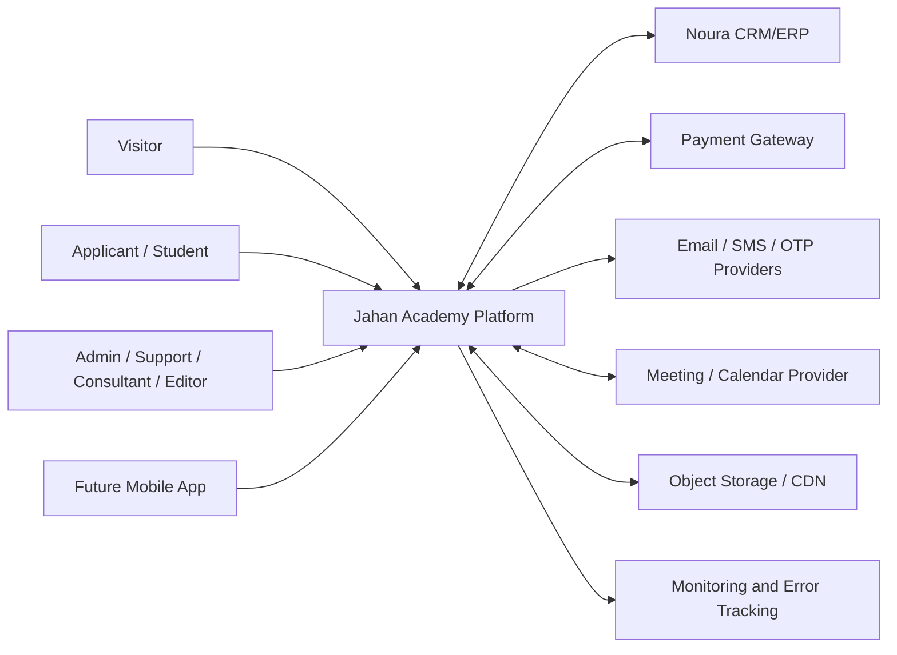
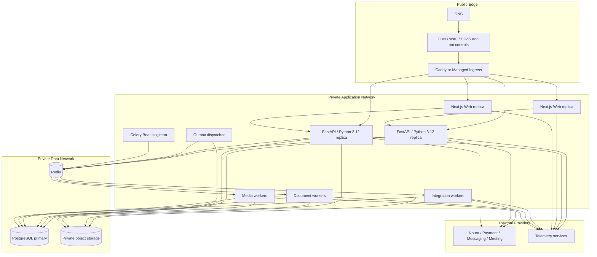
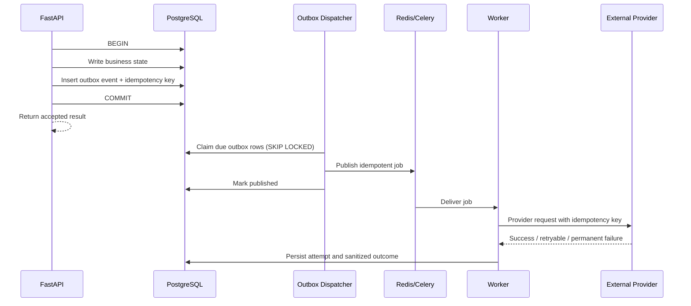
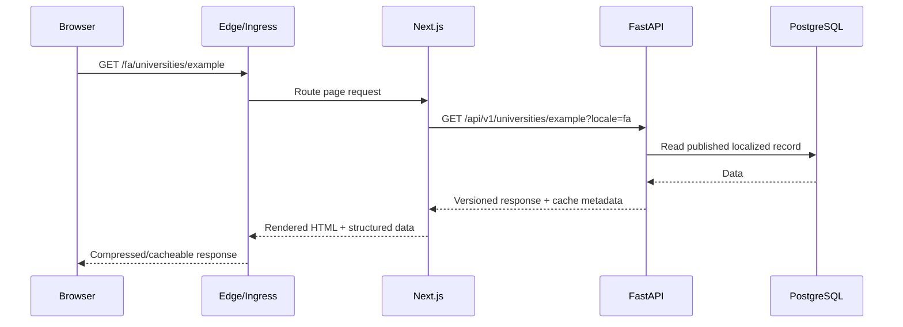
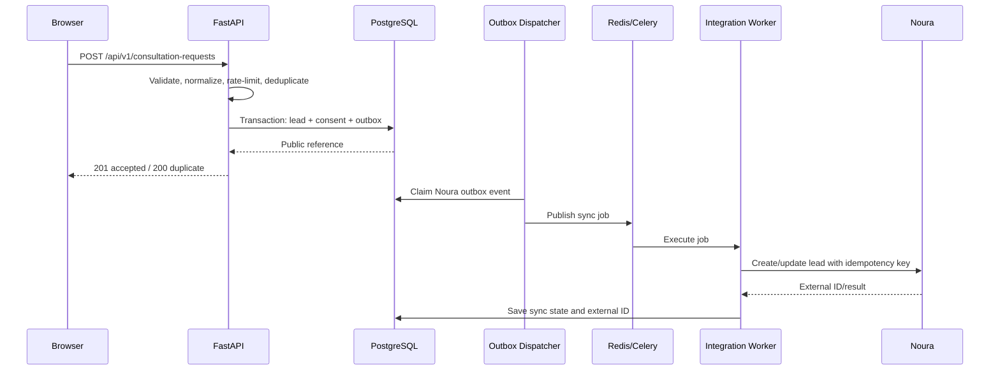
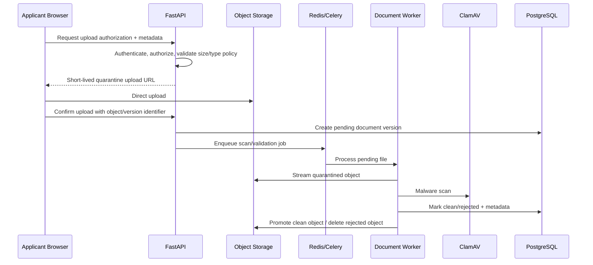
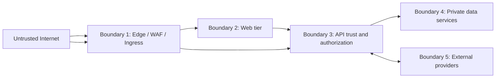

# Jahan Academy — System Architecture

**Status:** Approved target architecture
**Architecture scope:** Complete product, including public website, applicant portal, Admin, applications, documents, consultation, payments, LMS, notifications, and Noura integration
**Decision date:** 2026-09-22

## 1. Architecture Summary

Jahan Academy uses a separately deployable Next.js Web application and FastAPI backend on the feature-version-frozen Python 3.12 runtime. FastAPI is a domain-oriented modular monolith and the single authority for business rules, authentication, authorization, data access, and external integrations. Slow or scheduled operations run through Celery workers on the same Python 3.12 baseline. PostgreSQL is the durable system of record; Redis provides reconstructable session, cache, rate-limit, coordination, and queue state. Private files are stored in S3-compatible object storage and delivered through authorized short-lived access or a CDN according to their sensitivity.

The system starts as a small number of independently scalable deployment units rather than microservices:

1. Web
2. API
3. Worker processes
4. Scheduler
5. Outbox dispatcher, using the Worker image with a dedicated command

This architecture supports the final product without imposing microservice operational cost on the current team.

## 2. High-Level Architecture

```text
                               Internet
                                  │
                         DNS / Edge Security
                                  │
                    CDN + WAF / Rate Protection
                                  │
                                  ▼
                    Caddy or Managed Ingress/TLS
                                  │
                 ┌────────────────┴────────────────┐
                 │                                 │
        /, /fa, /en, /admin                   /api/v1, /health
                 │                                 │
                 ▼                                 ▼
          Next.js Web                    FastAPI API / Python 3.12
      Public + Applicant + Admin        Auth + Business + Contracts
                 │                                 │
                 └──────────────┬──────────────────┘
                                │ private network
                  ┌─────────────┼──────────────┬───────────────┐
                  ▼             ▼              ▼               ▼
           PostgreSQL 18     Redis 8      Object Storage    Observability
          System of record  Cache/Queue    Private S3       OTel/Sentry/
                                             │              Metrics/Logs
                                             ▼
                                         CDN / Signed
                                           Delivery

              PostgreSQL Outbox ──► Outbox Dispatcher ──► Redis Broker
                                                                 │
                                          ┌──────────────────────┼─────────────┐
                                          ▼                      ▼             ▼
                                  Integration Worker     Document Worker   Media Worker
                                          │                      │             │
                          ┌───────────────┼───────────┐          │             │
                          ▼               ▼           ▼          ▼             ▼
                        Noura        Email/SMS/OTP  Payments   ClamAV/PDF   FFmpeg/Images

                         Celery Beat ──► Redis Broker ──► Workers
```

Nginx is not part of the default architecture. Caddy is used for self-hosted ingress because it provides reverse proxying and automatic TLS. When the hosting platform already provides ingress, TLS, WAF, and routing, Caddy is omitted.

## 3. Architecture Principles

1. **One business authority:** Business rules live in FastAPI application/domain services, never separately in Next.js.
2. **Modular monolith first:** Backend modules have explicit ownership and interfaces but share one deployable API and one primary relational database.
3. **PostgreSQL is authoritative:** Redis, search indexes, CDN objects, and analytics are derived or supporting state.
4. **Durable async work:** Critical database changes and their follow-up jobs are coupled through a transactional outbox.
5. **Provider independence:** Noura, payments, messaging, meetings, storage, and search are accessed through adapters.
6. **Private by default:** Applicant documents, session state, staff data, and operational notes are not public assets.
7. **Contract-first clients:** FastAPI OpenAPI generates the TypeScript client used by Next.js.
8. **Observable boundaries:** Every request and job carries a correlation/trace identifier.
9. **Scale measured bottlenecks:** Components scale independently; new infrastructure requires evidence and an ADR.
10. **No deployment-time data ambiguity:** Migrations are controlled jobs, not automatically run by every API replica.

## 4. System Context



### 4.1 Human Actors

| Actor | Entry point | Main capabilities |
|---|---|---|
| Visitor | Public Web | Browse, search, read, submit free-consultation request |
| Applicant/User | Applicant Web; future Mobile | Profile, favourites, applications, documents, payments, courses, notifications |
| Consultant | Admin Web | Assigned leads/applications, notes, status updates, consultation outcomes |
| Support | Admin Web | All leads, assignments, initial contact, booking, operational corrections |
| Content Editor | Admin Web | Bilingual content, universities, Programs, SEO, media, publishing |
| Super Admin | Admin Web | Users, roles, configuration, audit, retries, privacy operations |

### 4.2 External Systems

| System | Direction | Integration pattern |
|---|---|---|
| Noura CRM/ERP | Bidirectional when contract permits | Versioned adapter, outbox, idempotency, retry, reconciliation |
| Payment gateway | Bidirectional | Server-created payment intent plus verified signed webhook |
| Email/SMS/OTP | Outbound plus delivery callback | Provider adapter, queued send, delivery status webhook |
| Meeting/calendar provider | Bidirectional | Provider adapter, scheduled creation/update/cancel, webhook where supported |
| S3-compatible storage | Bidirectional | Private buckets, presigned upload/download, server confirmation |
| CDN | Outbound delivery | Public media or authorized signed delivery; never the business source of truth |
| Error/telemetry services | Outbound | Redacted errors, traces, metrics, and logs |

## 5. Container and Deployment Architecture



The diagram shows multiple replicas to document the scale-ready topology. A first deployment may run one Web replica, one API replica, and appropriately sized workers. Stateless Web/API containers allow horizontal scaling without architectural change.

### 5.1 Deployment Units

| Unit | Responsibility | Scaling key |
|---|---|---|
| `web` | SSR/RSC, public pages, applicant and Admin UI, static asset delivery | HTTP request rate, CPU, render latency |
| `api` | REST/SSE endpoints, auth, authorization, validation, transactions, presigned URL coordination | Request rate, CPU, DB wait, p95 latency |
| `worker-integration` | Noura, payment reconciliation, email/SMS, webhooks, search indexing | Queue depth, provider latency/rate limits |
| `worker-document` | Virus scan orchestration, PDF, Excel, document metadata | Queue depth, CPU/memory, scan latency |
| `worker-media` | FFmpeg, thumbnails, image variants | CPU, memory, media backlog |
| `outbox-dispatcher` | Claim unpublished outbox rows and publish idempotent jobs | Undispatched row age/count |
| `scheduler` | Celery Beat schedules reminders, reconciliation, cleanup, retention | Singleton health and schedule delay |

All worker types use the same versioned backend image where practical, with different commands, queues, resource limits, and autoscaling policies.

## 6. Routing and Network Design

### 6.1 Public Routing

| Route | Target | Notes |
|---|---|---|
| `/fa/*`, `/en/*`, `/admin/*`, `/account/*` | Next.js Web | Public, Admin, and applicant interfaces |
| `/_next/*`, approved static assets | Next.js/CDN | Immutable caching for hashed assets |
| `/api/v1/*` | FastAPI | Versioned API; browser and future clients |
| `/api/v1/events/*` | FastAPI | SSE where one-way live updates are required |
| `/health/live` | Web/API | Process liveness only; not public-indexed |
| `/health/ready` | Web/API | Dependency-aware readiness; restricted where possible |
| media CDN hostname | CDN/object storage | Public content media or signed private delivery |

### 6.2 Same-Origin Browser Policy

Production should expose Web and API under the same public origin whenever practical. The ingress routes `/api/*` to FastAPI and all other application routes to Next.js. This reduces CORS exposure and makes secure cookie and CSRF policy easier to reason about. Future native mobile clients use the API hostname/route directly with a mobile-appropriate token flow defined before that client is implemented.

### 6.3 Network Zones

- Only ingress is internet-facing.
- Web and API accept application traffic only from ingress/private networking.
- PostgreSQL and Redis are never publicly reachable.
- Object storage blocks public access by default; only approved public marketing media may use a public/CDN policy.
- Worker management endpoints are private.
- Provider webhooks terminate at explicit FastAPI webhook routes with signature verification, replay protection, and rate limits.
- Production administration access uses identity-aware access/VPN or equivalent platform controls in addition to application authentication where available.

## 7. Web Architecture

Next.js contains three interface areas in one application unless future independent release cadence justifies separation:

1. **Public:** bilingual content, discovery, SEO pages, consultation conversion.
2. **Applicant:** onboarding, profile, applications, documents, payments, courses, notifications.
3. **Admin:** content, leads, applications, users, course operations, payments, integrations, audit.

Rules:

- Server Components render read-heavy pages and call FastAPI through the generated client.
- Client Components are limited to interactive controls, forms, editors, uploads, tables, and live updates.
- Public cache keys include locale, entity version, and relevant query state.
- Authenticated and personalized responses are private/no-store unless an explicitly safe cache strategy exists.
- Next.js does not connect directly to PostgreSQL or Redis.
- Next.js does not implement parallel business rules or authorize an action independently of FastAPI.
- A Web route may proxy browser requests only for cookie, upload, or streaming mechanics; the API remains authoritative.

## 8. Backend Modular Architecture

The executable directory contract, dependency rules, request flow, worker queues, testing strategy,
and module extraction policy are maintained in `BACKEND_ARCHITECTURE.md`.

```text
FastAPI
└── jahan
    ├── api/                    HTTP routes, dependencies, error translation
    ├── modules/
    │   ├── identity/           Users, identities, sessions, RBAC, consent
    │   ├── applicants/         Profiles, preferences, education, language, funding
    │   ├── catalog/            Countries, universities, Programs, intakes, search
    │   ├── content/            News, pages, FAQs, localization, SEO
    │   ├── consultations/      Leads, assignment, notes, booking, conversion
    │   ├── applications/       Applications, stages, tasks, reviews, history
    │   ├── documents/          Requirements, files, versions, verification
    │   ├── learning/           Courses, curriculum, enrolment, progress, assessment
    │   ├── commerce/           Pricing, orders, payments, refunds, invoices
    │   ├── communication/      Tickets, messages, and contact history
    │   ├── notifications/      Templates, preferences, delivery records
    │   ├── integrations/       Noura and provider coordination
    │   └── reporting/          Operational read models and exports
    ├── infrastructure/         SQLAlchemy, Redis, storage, queues, telemetry
    └── shared/                 Small stable cross-module primitives only
```

### 8.1 Layering Within a Module

```text
API Router
    │ maps HTTP input/output
    ▼
Application Service / Use Case
    │ transaction and authorization orchestration
    ▼
Domain Rules and Policies
    │ depends on repository/provider interfaces
    ▼
Infrastructure Adapters
    ├── SQLAlchemy repositories
    ├── Redis/cache/session adapters
    ├── Storage adapter
    └── External provider adapters
```

Dependencies point inward. SQLAlchemy models, FastAPI request objects, Redis clients, and provider SDK objects do not leak into domain rules.

### 8.2 Module Ownership Rules

- A module writes its own tables through its repositories.
- Another module requests a change through an application service or an internal event, not direct table mutation.
- Cross-module read joins are allowed in dedicated query/reporting services when reviewed and read-only.
- Critical state machines use explicit commands and append status/history events in the same transaction.
- Module extraction to a service requires measured scaling, security, ownership, or release-cadence need.

## 9. Data Architecture

### 9.1 PostgreSQL

PostgreSQL owns:

- Users, identities, roles, sessions/audit facts, consent, and privacy requests.
- Catalog, bilingual content, taxonomy, SEO configuration, and publication state.
- Leads, assignment, consultation booking, notes, status history, and Noura mapping.
- Applicant profiles, applications, requirements, documents metadata/version state, and reviews.
- Courses, enrolments, progress, assessments, orders, payments, refunds, and invoices.
- Notification records, provider delivery state, integration state, and transactional outbox.

Use foreign keys, unique/check constraints, precise decimal/minor-unit money, UTC timestamps, optimistic locking where concurrent editing is likely, and append-only histories for sensitive workflows.

### 9.2 Redis

Redis contains only state that is reconstructable or intentionally short-lived:

- Session lookup/revocation acceleration.
- OTP and authentication challenge state.
- Distributed rate-limit counters.
- Cache entries and invalidation versions.
- Celery broker/result metadata where required.
- Bounded distributed locks and singleton coordination.

Loss of Redis may temporarily log users out, pause jobs, or reduce performance, but must not lose accepted leads, applications, payments, enrolments, or audit facts.

### 9.3 Object Storage

Use separate logical buckets/prefixes and policies:

| Class | Access | Examples |
|---|---|---|
| Public content | CDN-readable after approval | University images, article media, public course thumbnails |
| Private applicant | No public access; authorized short-lived URL | Passport, transcript, language certificate, financial documents |
| Processing quarantine | Worker-only | Newly uploaded unscanned files |
| Generated private | Authorized short-lived URL | Application packs, consultation reports, invoices |
| Learning media | Signed delivery | Paid video, course downloads, certificates where private |

Database records, not object keys, define ownership and authorization. Object keys are opaque and contain no PII.

### 9.4 Search

Catalog and content search initially use PostgreSQL full-text/trigram capabilities through a `SearchProvider`. OpenSearch may be added as a derived index when multilingual relevance, faceting, typo tolerance, or workload measurements justify it. Reindexing must be possible from PostgreSQL.

## 10. Asynchronous Architecture

### 10.1 Job Classes

| Queue | Typical work | Characteristics |
|---|---|---|
| `critical` | Payment confirmation/reconciliation, security/privacy jobs | Highest observability; strict idempotency |
| `integration` | Noura sync, provider callbacks, meeting operations | Provider-specific rate/concurrency limits |
| `notification` | Email, SMS, reminders | Retryable; user preferences and suppression checked at execution |
| `document` | Scan, PDF, Excel, metadata extraction | CPU/memory-aware; private-data handling |
| `media` | FFmpeg, thumbnails, image variants | Resource-isolated; long-running |
| `maintenance` | Cleanup, retention, search reindex, aggregates | Scheduled and low priority |

### 10.2 Transactional Outbox Flow



Publication and job execution are at-least-once. Consumers must be idempotent. An outbox row is not considered resolved merely because a task was published; provider delivery and reconciliation state remain separately observable.

### 10.3 Retry Policy

- Classify errors as validation/permanent, authentication/configuration, rate-limited, or transient.
- Use bounded exponential backoff with jitter for transient errors.
- Respect provider `Retry-After` and concurrency limits.
- Move exhausted jobs to a visible failed/dead-letter operational state.
- Allow authorized manual replay with audit logging.
- Never log full document contents, secrets, tokens, or unnecessary provider payloads.

## 11. Critical Request Flows

### 11.1 Public Page Read



### 11.2 Consultation Submission and Noura Sync



Noura downtime never blocks storing an accepted consultation request.

### 11.3 Private Document Upload



A document is unavailable to reviewers until scan and server-side validation succeed.

### 11.4 Payment Confirmation

- API creates a pending order/payment record before redirecting to the gateway.
- The browser return URL is informational and cannot mark a payment successful.
- A signed provider webhook or server-to-server verification confirms the payment.
- Webhook events are deduplicated using provider event/payment IDs.
- Payment, order, invoice, enrolment, and outbox effects are committed transactionally where possible.
- Scheduled reconciliation detects missed or ambiguous callbacks.

## 12. Authentication and Authorization

### 12.1 Browser Authentication

- FastAPI creates opaque, rotated session identifiers in `HttpOnly`, `Secure`, `SameSite=Lax` cookies.
- Persistent session/audit facts are stored in PostgreSQL; Redis accelerates active-session lookup and revocation.
- State-changing requests require CSRF defense and Origin/Referer validation.
- Passwords use Argon2id. Reset/verification values are single-use, short-lived, and stored hashed.
- OTP state is short-lived and rate-limited by account, phone, IP, and device/risk signals.
- Google OAuth identities link through verified provider claims and conflict-safe account linking.
- Privileged staff support MFA and step-up authentication for sensitive operations.

### 12.2 Authorization

- FastAPI policy checks protect every object and operation.
- Public User personas share the `User` role; permissions derive from ownership and workflow state.
- Staff uses RBAC plus object scope: consultants only access assigned records unless granted broader permission.
- Authorization is repeated when issuing a private download URL.
- Sensitive actions require audit records containing actor, action, target, safe diff, time, and correlation ID.
- Frontend visibility improves UX but never grants permission.

## 13. Cache and Invalidation

- Hashed static assets use long-lived immutable caching.
- Published catalog/content reads may use CDN/Web/API caching with locale and entity version in the key.
- Publishing, archiving, or changing relevant data emits a cache-invalidation event after commit.
- Personalized, Admin, document, payment, and application workflow responses are private/no-store by default.
- Cache stampede protection uses short bounded locks and stale-while-revalidate only for safe public data.
- The system must remain correct with an empty cache.

## 14. Observability

Every public request, internal API request, queued job, provider call, and webhook carries a correlation/trace ID.

### 14.1 Signals

| Signal | Minimum coverage |
|---|---|
| Logs | Structured JSON, service/environment/version, correlation ID, safe actor/entity IDs, redaction |
| Traces | Ingress → Web → API → DB/Redis/provider; job publish and execution linkage |
| Metrics | Request rate/errors/latency, DB pool/wait, Redis health, queue depth/age, worker failure, outbox delay, provider results |
| Errors | Sentry or equivalent with release/environment and scrubbed request context |
| Audit | Immutable application-level history for privileged and sensitive operations |

### 14.2 Required Alerts

- Elevated API 5xx/error rate or latency.
- Database saturation, replication/backup failure, or low storage.
- Redis unavailable or persistent memory pressure.
- Oldest queue message/outbox row exceeds its service-level threshold.
- Noura/payment/messaging failure rate exceeds threshold.
- Scheduler heartbeat missing or duplicate schedulers detected.
- Malware scan unavailable or quarantine backlog growing.
- Backup or restore verification failure.

## 15. Reliability and Failure Behavior

| Failure | Expected behavior |
|---|---|
| Noura unavailable | Accept and persist lead; mark sync pending/failed; retry and allow audited manual replay |
| Email/SMS unavailable | Preserve notification record; retry; do not roll back completed business transaction |
| Redis unavailable | API degrades or rejects abuse-sensitive operations safely; durable records remain intact; jobs pause without loss from outbox |
| Worker unavailable | API continues for synchronous paths; queues/outbox accumulate and alert |
| Object storage unavailable | Metadata writes requiring upload completion fail safely; existing business records remain intact |
| Malware scanner unavailable | New files remain quarantined and unavailable to reviewers |
| Payment callback duplicated | Idempotent handler returns success without duplicating order/enrolment effects |
| PostgreSQL unavailable | Mutations fail closed; readiness fails; no false success is returned |
| One Web/API replica fails | Ingress removes unhealthy replica; other replicas continue when provisioned |
| CDN/cache stale | Versioned invalidation plus bounded TTL; authoritative API/DB remains correct |

## 16. Scalability Strategy

### 16.1 Scale Without Redesign

- Add stateless Web replicas.
- Add stateless API replicas and tune connection pooling within database limits.
- Scale each Celery queue independently.
- Add CDN cache coverage for public assets/pages.
- Partition heavy media/document work by queue and resource class.
- Add PostgreSQL read replicas only for proven read/reporting workloads with acceptable consistency.

### 16.2 Conditional Components

| Trigger | Candidate change |
|---|---|
| PostgreSQL search harms transactions or relevance/faceting is insufficient | Deploy OpenSearch through existing `SearchProvider` |
| Reporting queries affect operations | Add read replica or warehouse/ELT pipeline |
| One module has materially different scale/security/release ownership | Extract that module behind its existing interface/contract |
| Container count and autoscaling operations exceed Compose/platform capability | Adopt managed container orchestration or Kubernetes by ADR |
| High-volume media dominates worker fleet | Move media pipeline to specialized transcoding service/provider |

Microservices, Kubernetes, Kafka, OpenSearch, and a data warehouse are not default dependencies.

## 17. Backup and Disaster Recovery

- Encrypted PostgreSQL backups at least daily with 30-day retention; use point-in-time recovery when the provider supports it.
- Object storage versioning/lifecycle appropriate to data class and retention policy.
- Infrastructure configuration, migrations, and application code are version controlled; secrets are backed up through approved secret management.
- Redis is not treated as a durable backup source.
- Restore tests run on a schedule and before high-risk infrastructure changes.
- Recovery procedures define RPO/RTO after infrastructure selection; until approved, no stronger guarantee than the tested backup schedule is claimed.
- Disaster recovery includes database restore, object reconciliation, provider credential rotation, DNS/ingress restoration, and outbox/job replay validation.

## 18. Environment Topology

| Environment | Data/providers | Purpose |
|---|---|---|
| Local | Docker PostgreSQL/Redis/MinIO/Mailpit/ClamAV/Mock Noura; sandbox/fake providers | Development and automated integration testing |
| CI | Disposable PostgreSQL/Redis/storage substitutes; mocked provider contracts | Deterministic validation; no real personal data |
| Staging | Isolated production-like managed data services; provider sandboxes | UAT, migration, load, security, and recovery validation |
| Production | Managed PostgreSQL/Redis/object storage/CDN and real providers | Live service with monitoring, backups, and least privilege |

Production data must not be copied into lower environments unless an approved anonymization process removes personal and sensitive information.

## 19. Security Trust Boundaries



- All data crossing a boundary is validated and authenticated/authorized where applicable.
- TLS terminates at managed ingress/Caddy and is preserved internally when the platform/risk model requires it.
- External callbacks are untrusted even when they originate from an expected provider address.
- Provider responses and uploaded files are validated before use.
- Least-privilege service identities separate API, workers, migrations, backups, and operators.
- Database credentials for runtime services do not grant schema-owner or migration privileges.

## 20. Architectural Decisions and Non-Goals

### 20.1 Approved Decisions

- Caddy or managed ingress; no default Nginx layer.
- One Next.js application for Public, Applicant, and Admin interfaces initially.
- One FastAPI modular monolith as the business authority.
- PostgreSQL 18 as the system of record.
- Redis 8 plus Celery for distributed async execution.
- Transactional outbox for critical post-commit work.
- S3-compatible storage for all persistent files; private by default.
- REST/OpenAPI for product contracts; SSE before WebSockets for one-way live updates.
- External provider for video meetings; no self-hosted WebRTC platform.

### 20.2 Non-Goals at Initial Delivery

- No microservice fleet.
- No Kubernetes requirement.
- No Kafka/event-streaming platform.
- No public direct database/storage access.
- No business logic duplicated in Next.js.
- No synchronous dependency on Noura for consultation acceptance.
- No OpenSearch until measured need.
- No production reliance on local container filesystem.

## 21. Architecture Validation Checklist

- [ ] Web cannot connect directly to PostgreSQL or Redis.
- [ ] Only ingress is publicly reachable; data services are private.
- [ ] `/api/v1` contract and generated TypeScript client agree in CI.
- [ ] Every mutation has server authorization and authoritative validation.
- [x] Critical consultation mutation plus Noura outbox event commits in one PostgreSQL transaction.
- [ ] Jobs and webhooks are idempotent and replay-tested.
- [ ] Private uploads remain quarantined until scan/validation succeeds.
- [ ] Payment browser return cannot mark a payment successful.
- [ ] Redis loss does not lose authoritative business records.
- [x] Noura outage does not reject a valid stored consultation request; durable retry and manual recovery are implemented against the mock contract.
- [ ] Migrations run once through a controlled deployment job.
- [ ] Logs, traces, errors, and audit records redact secrets and unnecessary PII.
- [ ] Backup restoration and outbox/job recovery are tested.
- [ ] Load tests demonstrate the current approved capacity target.
- [ ] Adding a replica does not require local shared filesystem state.

## 22. Related Sources of Truth

- [PROJECT_CONTEXT.md](./PROJECT_CONTEXT.md)
- [SRS.md](./SRS.md)
- [TECH_STACK.md](./TECH_STACK.md)
- [INFORMATION_ARCHITECTURE.md](./INFORMATION_ARCHITECTURE.md)
- [DESIGN_SYSTEM.md](./DESIGN_SYSTEM.md)

Any change to service boundaries, system-of-record ownership, authentication authority, queue semantics, storage privacy, or critical integration delivery requires an Architecture Decision Record and corresponding updates to the related source-of-truth documents.
