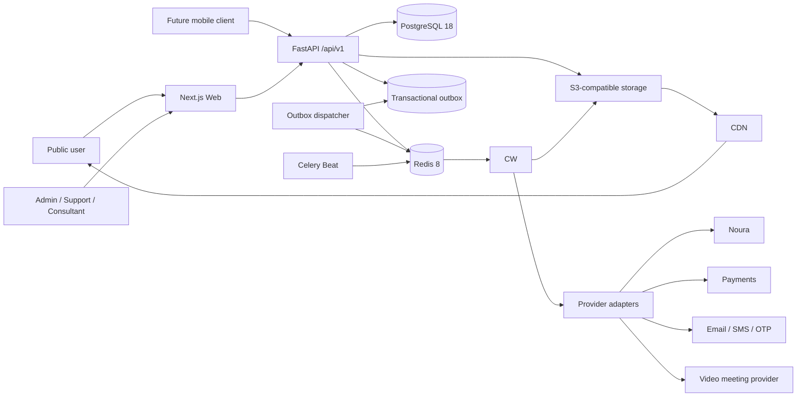

# Jahan Academy — Final Product Technology Stack

**Status:** Approved source of truth for implementation
**Decision date:** 2026-09-22
**Scope:** The complete target product, not only the first MVP release

## 1. Decision Summary

Jahan Academy will use a separated web-and-API architecture from the beginning:

- **Web applications:** Next.js, React, TypeScript, and Tailwind CSS.
- **Backend API:** Python and FastAPI as one domain-oriented modular monolith.
- **Background execution:** Celery workers and Celery Beat using Redis, with a PostgreSQL transactional outbox for critical events.
- **System of record:** PostgreSQL.
- **Files and media:** S3-compatible object storage behind a CDN.
- **Deployment:** containerized Web, API, Worker, and Scheduler processes behind Caddy or a managed ingress.

The backend is deliberately not split into microservices. It is one independently deployable API with explicit domain modules. This preserves development speed while providing a stable API boundary for the public website, Admin, a future mobile client, Noura, payments, LMS, notifications, and partner integrations.

## 2. Product Capabilities Driving the Decision

The target stack must support the full roadmap:

- Bilingual RTL/LTR public website and SEO-heavy content.
- Public applicant accounts, onboarding, profiles, favourites, comparisons, and notifications.
- Applications, document collection/review, status history, and consultant collaboration.
- Consultation booking, assignment, follow-up, and Noura synchronization.
- Course sales, payments, invoices, an LMS, progress, quizzes, and certificates.
- Admin content management, RBAC, audit logs, reporting, imports, and exports.
- Email, SMS, OTP, scheduled jobs, and durable retries.
- A future mobile application and external/partner API consumers.
- Growth beyond one server without requiring an early rewrite.

## 3. Approved Stack

| Area | Selected technology | Version policy |
|---|---|---|
| Frontend runtime | Node.js | 24 LTS; latest patched minor |
| Frontend package manager | pnpm through Corepack | Lock with `pnpm-lock.yaml` |
| Web framework | Next.js App Router | 16.3.3+ security-patched 16.x; upgrade by ADR |
| UI runtime | React | Version supported by the selected Next.js release |
| Web language | TypeScript | Strict mode; 5.9+ compatible release |
| Styling/components | Tailwind CSS, Radix UI, project-owned components | Tailwind 4.3+ compatible release |
| Localization | `next-intl` | Explicit `/fa` and `/en` routes |
| Web forms | React Hook Form + Zod | Client convenience only; API validation is authoritative |
| Rich text | Tiptap | Sanitized server-side allowlist |
| Backend runtime | CPython | 3.12.x; feature version locked to `3.12` for the project lifecycle |
| Backend package manager | uv | Commit `pyproject.toml` and `uv.lock` |
| API framework | FastAPI + Uvicorn | Latest mutually compatible stable versions |
| Validation/settings | Pydantic v2 + `pydantic-settings` | API schemas separated from persistence models |
| ORM | SQLAlchemy 2 | Async API where I/O concurrency provides value |
| Migrations | Alembic | One reviewed forward migration per schema change |
| PostgreSQL driver | asyncpg | Pinned compatible release |
| Primary database | PostgreSQL | 18.x; managed service preferred in production |
| Cache/session/rate state | Redis | 8.x stable major |
| Background jobs | Celery + Celery Beat | Celery 5.6.x compatible release |
| Durable integration events | PostgreSQL transactional outbox | Required for critical DB-to-job operations |
| Object storage | S3-compatible storage | Provider selected per environment; presigned access |
| CDN | Managed CDN | Provider selected with hosting; immutable asset URLs |
| Image processing | Pillow in API/workers; Next Image/Sharp at delivery | Original files retained according to policy |
| Video processing | FFmpeg worker | For LMS renditions, thumbnails, and metadata |
| Malware scanning | ClamAV scanning service | Required before applicant files become reviewable |
| Spreadsheet I/O | OpenPyXL | Admin imports/exports; import is asynchronous |
| PDF output | WeasyPrint from reviewed HTML/CSS templates | ReportLab only for exceptional low-level drawing needs |
| API contract | OpenAPI 3.1 generated by FastAPI | Versioned JSON API under `/api/v1` |
| TypeScript API client | `openapi-typescript` + `openapi-fetch` | Generated in CI; generated files are not handwritten |
| OAuth | Authlib | Google first; provider linkage is backend-owned |
| Password hashing | Argon2id | Calibrated parameters and rehash-on-login policy |
| Backend tests | pytest, pytest-asyncio, HTTPX, Testcontainers | pytest 9.x compatible release |
| Frontend tests | Vitest, Testing Library | Component and accessibility behavior |
| End-to-end tests | Playwright + axe-core | Critical bilingual and role-based journeys |
| Observability | OpenTelemetry, Sentry, Prometheus/Grafana | Correlation IDs across Web, API, and Worker |
| Backend logging | structlog JSON | PII/secret redaction is mandatory |
| Frontend/server logging | Pino JSON | PII/secret redaction is mandatory |
| Containers | Docker + Docker Compose | Reproducible local/staging/prod images |
| Reverse proxy/TLS | Caddy v2 or managed ingress | Never run Caddy and Nginx for the same role by default |
| CI/CD | GitHub Actions | Lint, types, tests, security, build, migration check, deploy |

Exact patch versions are locked in repository lockfiles and container digests. A major upgrade requires an Architecture Decision Record, migration plan, and regression run.

### 3.1 Python Runtime Freeze

Python `3.12` is the approved backend feature version. The project shall declare `requires-python = ">=3.12,<3.13"`, commit `.python-version` with `3.12`, use a Python 3.12 container image, and run backend CI on Python 3.12. Security and bug-fix patch releases within the 3.12 line are allowed and expected; moving to Python 3.13 or 3.14 is prohibited during implementation unless the Product Owner explicitly approves an ADR and a full dependency/test migration.

The compatibility review on 2026-09-22 found that many core packages explicitly support Python 3.14, but the complete selected dependency set does not yet provide the same assurance. In particular, stable Celery 5.6.3 publishes official classifiers only through Python 3.13, and OpenPyXL 3.1.5 does not publish a Python 3.14 classifier. Installation metadata alone is not treated as proof of supported production compatibility. Python 3.12 therefore provides the lower-risk frozen baseline for API, Worker, Scheduler, migrations, tests, and build tooling.

## 4. Target Architecture



### 4.1 Deployment Units

1. **Web:** Next.js public site and Admin UI.
2. **API:** FastAPI HTTP application.
3. **Worker:** Celery workers with separate queues and concurrency limits.
4. **Scheduler:** one Celery Beat instance with a distributed-lock/singleton deployment rule.
5. **Data services:** managed PostgreSQL, Redis, object storage, and CDN in production.
6. **Ingress:** Caddy for self-hosted infrastructure, or the platform's managed ingress/TLS.

Web and API should be exposed through one public origin where practical: `/` for Web and `/api` for API. This simplifies cookies, CSRF protection, monitoring, and browser policy while retaining a genuine service boundary.

### 4.2 Backend Domain Modules

- Identity, authentication, sessions, consent, and RBAC.
- Applicants, profiles, preferences, and onboarding.
- Countries, locations, universities, Programs, taxonomies, and search.
- Content, news, FAQs, media, localization, and SEO metadata.
- Consultation leads, assignment, booking, notes, and conversion.
- Applications, timelines, tasks, document requirements, and review.
- Courses, curriculum, enrolment, progress, quizzes, and certificates.
- Pricing, orders, payments, refunds, invoices, and reconciliation.
- Notifications, templates, preferences, and delivery tracking.
- Noura and other external integrations.
- Reporting, imports/exports, audit, privacy, and retention.

Each module owns its service layer and repository interfaces. Cross-module operations call explicit application services rather than importing another module's database internals. Separate services are introduced only after measured scaling or organizational need.

## 5. Frontend Decisions

### 5.1 Next.js Responsibilities

- Server-render and cache indexable public pages.
- Generate locale metadata, canonical URLs, hreflang, sitemaps, and structured data.
- Implement the applicant portal and Admin interfaces.
- Use Server Components for read-heavy presentation and Client Components only for interaction.
- Call the FastAPI service through the generated client; it must not own domain persistence.
- Serve a Backend-for-Frontend route only when browser-cookie, upload, or streaming constraints require it. A BFF route may proxy but must not duplicate business rules.

### 5.2 State and Data Fetching

- Prefer URL state and server-rendered data for public search/filter pages.
- Use TanStack Query only for authenticated, interactive server state that benefits from caching or optimistic behavior.
- Keep transient UI state local; add Zustand only after an actual shared-client-state requirement appears.
- Never duplicate authoritative domain state in a frontend store.

### 5.3 Accessibility and Localization

- WCAG 2.2 AA is the product target.
- `dir`, typography, spacing, icons, focus order, and animation behavior must work in both RTL and LTR.
- Translation completeness is enforced before publishing localized content.
- Persian and Latin digits, Jalali display, Gregorian storage, currencies, and phone numbers use explicit locale-aware formatters.

## 6. Backend and API Decisions

### 6.1 FastAPI

FastAPI is selected because the complete product benefits from an independent typed API, automatic OpenAPI, Pydantic validation, dependency injection, async I/O, Python's document/data ecosystem, and a clean client boundary for Web, mobile, Noura, and partners.

Rules:

- Routers contain HTTP translation, not business logic.
- Application services own use cases and transaction boundaries.
- Domain rules are framework-independent where practical.
- Repositories own persistence queries.
- Pydantic request/response models are distinct from SQLAlchemy models.
- Errors use a stable machine-readable envelope with correlation ID.
- Dates are ISO 8601 UTC; money is decimal/minor-unit plus ISO 4217 currency.
- Pagination is cursor-based for high-change operational lists and bounded page-based for public catalog UX.

### 6.2 Contract Management

- `/api/v1` is the stable public contract boundary.
- FastAPI's OpenAPI document is validated and diffed in CI.
- Breaking changes require a new API version or a documented compatibility window.
- The web client is generated from the accepted contract.
- Consumer-driven/contract tests cover payments, Noura, messaging, and generated-client compatibility.

### 6.3 Realtime

Use Server-Sent Events for one-way status and notification updates. Use WebSockets only for genuinely bidirectional features. Consultation video itself uses an external provider adapter rather than a custom WebRTC platform.

## 7. Data, Search, Cache, and Jobs

### 7.1 PostgreSQL

PostgreSQL is authoritative for business data. Use foreign keys, unique/check constraints, row versions where needed, and append-only histories for sensitive workflows. Extensions require review; anticipated extensions are `pg_trgm`, `unaccent` where language testing permits, and `pgcrypto` only when its specific functions are required.

### 7.2 Search

The initial implementation uses PostgreSQL full-text/trigram search behind a `SearchProvider` interface. OpenSearch becomes an approved production component when measured needs include advanced multilingual relevance, typo tolerance/facets beyond PostgreSQL, or sustained query/index load that harms transactional workloads. The provider boundary is part of the final architecture even if OpenSearch is not deployed on day one.

### 7.3 Redis

Redis is used for:

- Opaque session lookup/cache and revocation acceleration.
- Distributed rate limits and abuse controls.
- Short-lived OTP/challenge state.
- Celery broker and result/status metadata where required.
- Cache entries that can be reconstructed from an authoritative source.
- Distributed locks with bounded leases for singleton jobs.

Redis is not the only store for leads, applications, payments, enrolments, or audit events.

### 7.4 Celery and Transactional Outbox

Celery handles slow, retryable, or scheduled work: Noura sync, notifications, imports, PDF generation, virus scanning, video processing, search indexing, and cleanup. Separate named queues isolate integration, notification, document, and media workloads.

For any event that must not be lost after a database commit, the API writes the business change and an outbox row in the same PostgreSQL transaction. A dispatcher publishes the event with an idempotency key. Workers use bounded exponential backoff, jitter, dead-letter/failure states, and manual replay controls.

## 8. Identity and Security Architecture

- FastAPI owns identity for public users and staff; authentication logic is not split between frameworks.
- Browser clients receive opaque, rotated, `HttpOnly`, `Secure`, `SameSite=Lax` session cookies.
- Session secrets/tokens are stored hashed; Redis accelerates lookups while PostgreSQL preserves durable session/audit facts.
- State-changing cookie-authenticated requests require CSRF protection plus Origin/Referer validation.
- Passwords use Argon2id; recovery and verification links are single-use and short-lived.
- Mobile OTP supports Iranian and international E.164 numbers through a provider adapter with attempt, resend, IP, and destination throttles.
- Google OAuth identities link only through a verified, conflict-safe account-linking flow.
- Staff RBAC is enforced in backend policies; UI hiding is never authorization.
- MFA is required for privileged production roles when the provider and operational process are configured.
- Applicant documents use private buckets, short-lived presigned URLs, MIME/signature checks, size limits, malware scanning, encryption at rest, and audit trails.
- Secrets come from environment/secret management and never from the repository or logs.
- Dependency, image, secret, and SAST scans run in CI; production images run as non-root with minimal packages.

## 9. Files, Media, PDF, and LMS

- Direct browser uploads use short-lived presigned URLs followed by backend confirmation and scanning.
- Files are identified by opaque IDs; object keys do not expose names, emails, or passport numbers.
- Pillow validates images and generates server-side variants where business workflows require them.
- Next Image/Sharp handles delivery-time web optimization, not authoritative ingestion validation.
- WeasyPrint renders branded bilingual HTML/CSS templates for invoices, certificates, and application packs; automated visual fixtures cover Persian shaping and pagination.
- OpenPyXL supports reviewed templates, validation reports, idempotent imports, and asynchronous exports.
- FFmpeg processing runs in resource-isolated workers. Production learning video should use signed CDN delivery; DRM/adaptive-streaming provider choice remains an infrastructure decision.

## 10. Quality Strategy

### 10.1 Required Test Layers

- Unit tests for domain rules, permissions, pricing, state machines, deadlines, and mapping logic.
- PostgreSQL integration tests for constraints, transactions, locking, migrations, repositories, and outbox behavior.
- Redis/Celery integration tests for retries, idempotency, routing, and scheduled jobs.
- API tests for authentication, RBAC, validation, pagination, privacy, and stable errors.
- Contract tests for generated TypeScript clients and external adapters.
- Frontend component/accessibility tests in both directions and languages.
- Playwright tests for consultation, staff lead handling, applicant onboarding/application, booking, payment, enrolment, and document review.
- Load tests using k6 or Locust before production milestones.
- Backup restore, migration rollback/forward-fix, incident, and disaster-recovery drills.

### 10.2 CI Gates

1. Formatting and linting: Ruff for Python; ESLint/Prettier for TypeScript.
2. Type checks: mypy or Pyright for backend policy; `tsc --noEmit` for frontend.
3. Unit, integration, contract, accessibility, and selected E2E tests.
4. OpenAPI breaking-change check and generated-client freshness check.
5. Alembic migration upgrade on a clean database plus schema drift check.
6. Dependency, secret, image, and static security scans.
7. Production builds and image vulnerability policy.
8. Lighthouse budgets for representative public pages.

## 11. Deployment and Scalability

### 11.1 Local Development

Docker Compose provides PostgreSQL, Redis, Mailpit, MinIO, ClamAV, and the Mock Noura service. Web and API may run on the host for fast reload. Development dependencies must match production major versions.

### 11.2 Staging and Production

- Prefer managed PostgreSQL, Redis, object storage, CDN, email, and secrets.
- Deploy immutable Web, API, Worker, and Scheduler images.
- Run database migrations as a controlled pre-deploy job, never from every API replica.
- Use rolling/blue-green deployment, health/readiness checks, graceful shutdown, and rollback-compatible schema changes.
- Daily encrypted backups with 30-day retention are the minimum; restore tests are mandatory.
- Scale Web/API horizontally; scale workers independently by queue and workload.
- Introduce read replicas, OpenSearch, queue partitioning, or Kubernetes only from measured thresholds and an ADR.

### 11.3 Initial Capacity Baseline

The unknown traffic forecast does not justify speculative infrastructure, but implementation and load testing must initially demonstrate at least 100 concurrent public users and 20 concurrent staff users without violating agreed API and Core Web Vitals targets. Capacity targets are revised after analytics and business campaigns provide real data.

## 12. Repository Shape

```text
apps/
  web/                    Next.js public, applicant, and Admin interfaces (planned)
packages/
  ui/                     Design tokens and reusable React components
  api-client/             Generated TypeScript client
  config/                 Shared frontend build/lint configuration
backend/
  app/
    api/                  FastAPI composition root and HTTP boundary
    core/                 DB, cache, configuration and observability
    modules/              Domain-oriented backend modules
    shared/               Stable domain-neutral primitives
    workers/              Celery app, queues and task entrypoints
  alembic/                Database migrations
  tests/                  Architecture, unit, integration and contract tests
  pyproject.toml          Python dependency and tooling policy
  uv.lock                 Reproducible Python lockfile
tests/e2e/                Cross-application Playwright journeys (planned)
infra/
  compose/                Local/staging Compose definitions
  caddy/                  Self-hosted ingress configuration
docs/
  adr/                    Architecture Decision Records
```

The exact workspace may use a single repository with pnpm for JavaScript packages and uv workspaces/project management for Python. JavaScript and Python lockfiles are both committed.
The executable backend layout and module dependency rules are defined in `BACKEND_ARCHITECTURE.md`.

## 13. Rejected or Conditional Alternatives

| Alternative | Decision | Reason |
|---|---|---|
| Next.js-only backend | Rejected for final target | The complete product needs a durable independent API, Python-heavy document/data jobs, mobile readiness, and multiple integrations |
| Microservices from day one | Rejected | Excess operational and consistency cost for the current team; modular boundaries retain an extraction path |
| Prisma | Replaced | SQLAlchemy/Alembic match the selected Python backend and provide deeper query/transaction control |
| PostgreSQL-only job runner | Replaced for general jobs | Celery/Redis provide routing, scheduling, concurrency, retries, and workload isolation; PostgreSQL outbox remains for atomic delivery |
| MongoDB | Rejected | Relational workflows, constraints, reporting, RBAC, and transactional histories fit PostgreSQL |
| Self-hosted WebRTC/video platform | Rejected initially | High operational and compliance burden; use an adapter to a specialized provider |
| OpenSearch on day one | Conditional | Provider boundary is required; deployment waits for measured relevance/load need |
| Kubernetes on day one | Conditional | Docker and managed services are sufficient until replica/operations complexity justifies orchestration |
| Caddy plus Nginx | Rejected by default | One ingress/proxy is enough; dual proxy layers add configuration and debugging cost |
| ReportLab as primary PDF engine | Replaced | HTML/CSS templates are easier to maintain and visually verify for bilingual RTL documents |

## 14. Version and Change Policy

- Patch/minor security updates may be adopted after CI and staging verification.
- Runtime, framework, database, queue, ORM, and storage-provider major changes require an ADR.
- Python 3.12 is the fixed backend feature version. Patch upgrades within 3.12 are allowed for security and bug fixes; any move to 3.13+ requires explicit Product Owner approval, an ADR, a fresh compatibility audit, regenerated lockfile, container rebuild, and full regression/load test.
- Database migrations use expand/migrate/contract patterns for zero/low-downtime changes.
- Provider-specific behavior must remain behind project interfaces.
- New infrastructure is introduced only with an owner, monitoring, backup/restore plan, security review, and exit strategy.

## 15. Authoritative References

- [Next.js releases](https://nextjs.org/blog)
- [Node.js release schedule](https://nodejs.org/en/about/previous-releases)
- [Python releases](https://www.python.org/downloads/)
- [Celery package metadata](https://pypi.org/project/celery/)
- [OpenPyXL package metadata](https://pypi.org/project/openpyxl/)
- [FastAPI features](https://fastapi.tiangolo.com/features/)
- [Pydantic documentation](https://docs.pydantic.dev/latest/)
- [SQLAlchemy 2 documentation](https://docs.sqlalchemy.org/en/20/)
- [Alembic documentation](https://alembic.sqlalchemy.org/en/latest/)
- [PostgreSQL versioning policy](https://www.postgresql.org/support/versioning/)
- [Redis documentation](https://redis.io/docs/latest/)
- [Celery documentation](https://docs.celeryq.dev/en/stable/)
- [uv project documentation](https://docs.astral.sh/uv/concepts/projects/)
- [Caddy automatic HTTPS](https://caddyserver.com/docs/automatic-https)
- [OpenTelemetry documentation](https://opentelemetry.io/docs/)

Changes to this document must be reflected in `PROJECT_CONTEXT.md`, `SRS.md`, and `TECH_STACK_COMPARISON.md` in the same change.
