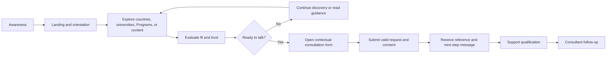
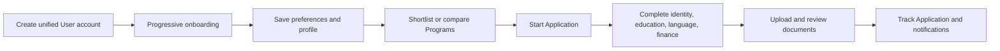

# Jahan Academy — User Journeys

> **Version:** 1.0
> **Scope:** MVP v1, with Post-MVP boundaries explicitly marked
> **Date:** September 22, 2026
> **Source of truth:** [PROJECT_CONTEXT.md](./PROJECT_CONTEXT.md)
> **Requirements:** [SRS.md](./SRS.md)

## 1. Purpose

This document describes how each Jahan Academy user type reaches a goal, which product touchpoints they use, what information and reassurance they need, where friction may occur, and how the system should respond.

Public personas are behavioral segments, not separate authorization roles in the MVP. They browse as unauthenticated Visitors and may submit a free-consultation request without creating an account. Administrative roles have distinct server-enforced permissions.

## 2. Journey Design Principles

1. **Consultation-first:** The primary MVP outcome is a successfully persisted free-consultation request.
2. **Discover before asking:** Visitors can browse, search, filter, and evaluate public information without registration.
3. **Progressive commitment:** The website asks for personal information only when the user requests consultation.
4. **Context preservation:** A request started from a university or Program retains that context automatically.
5. **Trust before conversion:** Verified facts, official source links, transparent tuition/deadline information, Privacy, Terms, and clear next steps appear before or near the CTA.
6. **Bilingual parity:** Persian RTL and English LTR offer equivalent content and task completion.
7. **No dead ends:** Empty results, errors, and incomplete decisions provide recovery, reset, relevant content, or consultation actions.
8. **Mobile-first completion:** Critical discovery and consultation tasks remain usable with one hand and without horizontal scrolling.
9. **Accessible by default:** Keyboard operation, visible focus, persistent labels, understandable validation, and appropriate contrast apply throughout.
10. **Honest scope:** MVP must not imply working application tracking, document upload, paid booking, favorites, or comparison features.

## 3. Shared Public Journey Funnel

### 3.1 Shared entry points

- Organic search landing on a country, university, Program, or article.
- Direct visit to the homepage.
- Social, advertising, referral, or campaign traffic.
- Shared filtered-result URL.
- Direct consultation CTA.

### 3.2 Shared conversion rules

- The primary CTA is `درخواست مشاوره رایگان` / `Request Free Consultation`.
- Consultation requires no account.
- Mobile number and privacy/contact consent are mandatory; email and qualification fields are optional.
- Successful local persistence is the point of acceptance, regardless of Noura availability.
- Success displays a random, non-sequential reference and explains that the team will make contact.

## 4. Public Persona Journeys

### 4.1 Student Journey

### Persona

- **Situation:** Currently studying and exploring future Bachelor, Master, or PhD options.
- **Primary need:** Understand realistic destinations and Programs within academic, language, timing, and budget constraints.
- **Likely concerns:** Unclear requirements, deadlines, cost, language score, credibility of information, and when to start.
- **MVP goal:** Discover relevant options and request personalized guidance.

| Stage | User goal and actions | Product touchpoints | User questions/emotion | Required experience | Success signal |
|---|---|---|---|---|---|
| Awareness | Searches for study destinations, universities, fields, or deadlines | Search result, article, homepage | “Where should I begin?” — uncertain | Clear value proposition and visible consultation CTA | Relevant landing-page visit |
| Orientation | Selects language and scans destinations/services | Header, hero, destination cards, guidance content | “Is this relevant to my level?” | Immediate routes to Programs and universities | Opens discovery page |
| Discovery | Searches by title and filters level, field, and intake | Program list, filters, active chips, sort | Curious but easily overwhelmed | Plain labels, URL-persisted filters, result count, reset | Applies at least one useful filter |
| Evaluation | Opens Program/university details | Detail pages, tuition, duration, deadline, language, admission, official source | “Can I afford and qualify for this?” | Structured verified facts and related options | Views detail/official source |
| Decision | Chooses to ask for guidance | Contextual CTA | “Will someone understand this exact Program?” | Preserve Program/university context | Opens consultation form |
| Conversion | Completes required fields and optional qualification data | Responsive consultation form | Cautious about privacy and effort | Clear required/optional labels, validation, consent links | Accepted request |
| Confirmation | Saves reference and waits for contact | Success state | Reassured if next step is explicit | Reference code and contact expectation | Success screen viewed |

### Student-specific opportunities

- Explain academic levels and intake terminology near filters.
- Surface deadline and teaching-language information high on Program detail.
- Link beginner guidance from empty or uncertain states.
- Ask age, current occupation, and budget only as optional qualification context.

### 4.2 Graduate Journey

### Persona

- **Situation:** Has completed a qualification and is considering postgraduate study or a career-aligned academic move.
- **Primary need:** Find Programs that align previous education, work history, budget, and desired start date.
- **Likely concerns:** Study gap, eligibility, field change, document readiness, and return on investment.
- **MVP goal:** Shortlist plausible academic directions and reach a consultant.

| Stage | User goal and actions | Product touchpoints | Friction/risk | Required experience | Success signal |
|---|---|---|---|---|---|
| Awareness | Enters through postgraduate/career content | Article, search result, homepage | Generic advice feels irrelevant | Outcome-oriented headlines and clear source/date | Continues to Program discovery |
| Exploration | Filters by Master/PhD, field, and intake | Program list | Cannot yet filter every personal condition | Explain current filters and offer consultation for nuanced cases | Opens multiple details |
| Validation | Reviews admissions, duration, fees, language, deadlines | Program detail | Missing or stale facts undermine trust | Show only verified values and official URL | Uses official source or CTA |
| Self-assessment | Compares facts mentally with background | Related Programs, FAQs, guidance | No MVP profile or chance calculator | Avoid promising automated eligibility; offer human review | Opens contextual form |
| Conversion | Adds occupation, budget range, timing, and message | Consultation form | Long form or sensitive questions | Optional qualification fields and `Prefer not to say` | Qualified request stored |
| Follow-up | Discusses study gap/field alignment with consultant | Offline contact, operational lead record | Repeating information | Consultant sees source and submitted context | Contacted/Qualified status |

### Graduate-specific opportunities

- Provide content addressing study gaps, field transitions, language requirements, and postgraduate timelines.
- Make Program official source and last-reviewed information easy to locate.
- Preserve free-text context so the graduate can describe non-standard history.

### 4.3 Prospective Educational Immigrant Journey

### Persona

- **Situation:** Evaluates education as a migration path and may begin with a destination rather than a specific institution.
- **Primary need:** Understand destination choices, education options, approximate budget, and a realistic sequence of action.
- **Likely concerns:** Trust, total cost, immigration complexity, timing, and misleading promises.
- **MVP goal:** Select a destination/education direction and request consultation.

| Stage | User goal and actions | Product touchpoints | User questions | Required experience | Success signal |
|---|---|---|---|---|---|
| Awareness | Searches destination-led migration/study topics | Country page, article, homepage | “Which country suits me?” | Neutral educational framing; no guaranteed outcomes | Country content engagement |
| Destination discovery | Browses countries and related universities | Destination cards, country detail, university list | “What options exist there?” | Clear country-to-university navigation | Opens related university |
| Cost/timing evaluation | Reviews tuition, Program duration, intake, deadline | Program list/detail | “Can I fund and time this?” | Consistent currency/range display and transparent unknowns | Interacts with Programs |
| Trust evaluation | Checks About, source links, Privacy, contact details | About, Contact, official URLs, policies | “Is this organization credible?” | Clear identity, policies, and verifiable sources | Returns to CTA |
| Consultation request | Supplies destination, intake/year, optional budget and personal context | Consultation form | “Will I be pressured or rejected?” | Explain optional fields and contact consent | Accepted request |
| Human guidance | Receives initial qualification and consultant contact | Support/consultant workflow | “What is the next concrete step?” | Staff have complete source/qualification context | Qualified or appropriately closed |

### Migration-specific safeguards

- Do not promise visas, admission, or migration outcomes.
- Distinguish academic Program facts from immigration advice.
- Display `Contact us` when reliable numeric pricing is unavailable rather than inventing a figure.

### 4.4 University Applicant Journey

### Persona

- **Situation:** Has a concrete intention to apply and may already know the country, university, or Program.
- **Primary need:** Validate details quickly and begin a trackable human-assisted process.
- **Likely concerns:** Missing deadlines, exact requirements, application fees, response speed, and repeating information.
- **MVP goal:** Submit a high-intent consultation request tied to the exact Program/university.

| Stage | User goal and actions | Product touchpoints | Friction/risk | Required experience | Success signal |
|---|---|---|---|---|---|
| Direct lookup | Searches a named university or Program | Search, university/Program list | Poor exact-name matching | Locale-aware case-insensitive search | Exact result opened |
| Detail verification | Checks deadline, intake, fee, requirements, language, official URL | Program detail | Stale or ambiguous deadlines | Structured intake-specific data and official source | CTA click from detail |
| Contextual request | Opens form from the chosen entity | Context banner/read-only summary | Losing selected Program | Trusted hidden ID plus visible concise context | Context included in payload |
| Submission | Enters required data, intended start, optional background/budget | Consultation form | Duplicate clicks or form error | In-flight button state and recoverable validation | One accepted lead |
| Confirmation | Receives reference and contact expectation | Success state | Wants immediate tracking | Clearly state that public tracking is not in MVP | Reference retained |
| Operational handoff | Support reviews and assigns consultant | Admin lead detail | Slow assignment | New-lead visibility and assignment controls | Assigned status |

### Applicant-specific opportunities

- Keep the consultation CTA adjacent to key admission facts.
- Use the source Program/university as staff context, not as editable visitor text.
- Avoid showing Post-MVP Application tracking or document upload as available.

### 4.5 General User / Career Explorer Journey

### Persona

- **Situation:** Interested in education or career development but has not formed a specific migration or application plan.
- **Primary need:** Learn, build confidence, and determine whether consultation is appropriate.
- **Likely concerns:** Information overload, unfamiliar terminology, and uncertainty about readiness.
- **MVP goal:** Consume useful content, explore options, and optionally request orientation.

| Stage | User goal and actions | Product touchpoints | Required experience | Success signal |
|---|---|---|---|---|
| Learn | Reads articles, FAQs, and service explanations | News, guidance, Services | Accessible language and semantic content structure | Reads or visits related content |
| Explore | Opens destination, university, or Program discovery | Internal links and homepage modules | Low-commitment browsing without login | Starts discovery |
| Clarify | Uses FAQs and related content to understand terms | FAQs, related/latest content | Answers close to the decision point | Expands FAQ or follows guide |
| Decide | Determines whether to talk to a specialist | Global CTA | CTA should be helpful, not coercive | Opens form or continues learning |
| Request orientation | Selects `Unknown` intake where appropriate and adds a message | Consultation form | Support uncertainty explicitly | Valid request accepted |

### General-user opportunities

- Allow `Unknown` intake and incomplete certainty without blocking the request.
- Use content CTAs relevant to the article topic.
- Provide next-best content instead of forcing conversion.

## 5. Operational Role Journeys

### 5.1 Support Staff Journey

### Goal

Turn new consultation requests into clean, assigned, actionable leads while preventing requests from being lost.

| Stage | Staff action | System behavior | Decision/support needed | Completion signal |
|---|---|---|---|---|
| Login | Authenticates with email/password | Secure session or generic denial; lockout policy enforced | Password recovery if needed | Authorized dashboard |
| Triage | Opens New/Pending leads and filters/searches | Shows newest records, source context, sync status, and safe contact data | Identify urgency and duplicates | Lead opened |
| Initial contact | Calls user and records result/note | Saves timestamped note and permitted status change | Contacted vs unreachable | `Contacted` or appropriate state |
| Qualification | Reviews destination, intake/year, age, occupation, marital status, budget, and message | Optional/withheld values display neutrally | Qualified vs Not Qualified based on complete context, not protected/optional field alone | Status updated |
| Assignment | Selects consultant | Creates one current assignment and closes previous assignment if reassigned | Match consultant expertise/workload | `Assigned` with history |
| Sync recovery | Filters Failed Noura syncs and retries | Queues idempotent retry and audit event | Retry only after reviewing sanitized failure | Pending/Synced/Failed result |
| Closure | Archives or closes operationally completed record | Retains audit/history; no permanent delete | Select correct final status | Converted/Closed/Archived |

### Support pain-point controls

- Do not mix operational and Noura sync statuses.
- Make source Program/university and public reference visible on the lead detail.
- Warn before navigation when notes/edits are unsaved.
- Search and filters must support status, assignee, sync state, and creation time.

### 5.2 Consultant Journey

### Goal

Work only assigned leads, understand their context quickly, record outcomes, and move them through permitted statuses.

| Stage | Consultant action | System behavior | Guardrail | Completion signal |
|---|---|---|---|---|
| Login | Authenticates | Opens scoped assigned-lead view | No access to admin/content/user management | Authorized list |
| Prioritize | Sorts/reviews assigned leads | Shows actionable summary and recent status | Unassigned/other consultants’ data never returned | Lead selected |
| Prepare | Reviews source page, desired country, intake/year, optional profile/budget, notes | Presents verified captured context | Sensitive optional data used only for service delivery | Ready to contact |
| Consult | Contacts applicant outside the MVP system | Allows outcome note and permitted status update | No unapproved status/assignment mutation | Note saved |
| Follow up | Revisits open lead and updates result | Preserves note/status history | Cannot overwrite audit history | Qualified/Converted/Closed |

### Consultant authorization failure journey

1. Consultant requests a lead not currently assigned to them.
2. Server applies ownership scope before returning data.
3. Request is denied using an authorization-safe response.
4. No lead attributes appear in response, logs exposed to user, or client cache.
5. Security-relevant event is recorded where appropriate.

### 5.3 Content Editor Journey

### Goal

Create trustworthy bilingual content and publish it without breaking localization, SEO, or entity relationships.

| Stage | Editor action | System behavior | Guardrail | Completion signal |
|---|---|---|---|---|
| Login/navigation | Opens content module | Shows only permitted modules/actions | Server RBAC | Correct module loaded |
| Create | Selects country, university, Program, news, FAQ, or media | Creates Draft with stable ID | Program requires one university | Draft saved |
| Enter translations | Completes Persian and English fields | Maintains one shared slug and separate localized content | No cross-language fallback | Translation completeness visible |
| Add structured data | Adds tuition/intakes/deadlines/fees/media/SEO as applicable | Validates domain rules and relationships | Exact/range tuition rules; real media type checks | Valid form |
| Preview | Reviews both directions and responsive layout | Renders unpublished preview securely | Draft stays non-public/indexable | Preview accepted |
| Publish | Requests publication | Blocks missing required bilingual/SEO fields; records actor/time | Only valid complete entity publishes | Published in both locales |
| Maintain | Corrects or archives content | Updates metadata/sitemap/cache; protects dependencies | Published/referenced records are not destructively deleted | Updated/Archived state |

### Content-editor experience requirements

- Translation completeness and validation should be visible before publish is attempted.
- Forms protect unsaved work and identify the exact invalid locale/field.
- Placeholder AI-generated facts must not be treated as approved content.
- Official source URL and media attribution should be easy to maintain.

### 5.4 Super Admin Journey

### Goal

Operate and govern the whole platform safely, including users, permissions, content, leads, synchronization, configuration, audits, and data lifecycle.

| Stage | Admin action | System behavior | Risk control | Completion signal |
|---|---|---|---|---|
| Secure access | Logs in or recovers password | Lockout, expiring reset, secure session | Security events logged without secrets | Dashboard access |
| Configure roles/users | Creates/deactivates admin user and assigns one approved role | Validates unique email and permissions | Only Super Admin; changes audited | Active/inactive user state |
| Govern content | Reviews/manages all content and dependencies | Same publication/archive rules as editors | Dependency checks before deletion | Valid lifecycle transition |
| Oversee leads | Views all leads, assignment, notes, status and sync | Full operational access with audit | Permanent panel deletion unavailable | Correct operational state |
| Recover integration | Reviews failures and triggers manual retry | Queues idempotent action and stores audit | Provider secrets/details protected | Sync progresses or remains diagnosed |
| Audit | Searches immutable audit history | Returns permitted event metadata/redacted diffs | Audit entries not editable in UI | Event verified |
| Privacy lifecycle | Verifies request and anonymizes eligible lead | Removes identifying fields, retains permitted audit/aggregate evidence | Legal retention checked; action audited | Anonymization complete |

### Super Admin exception journeys

- **Delete content:** Permanent deletion is available only for authorized Draft content without dependencies; otherwise Archive/soft delete is required.
- **Noura unavailable:** Admin can verify local acceptance and queue state; cannot expose provider credentials or mark `Synced` without confirmed external ID.
- **Audit investigation:** Full audit access remains read-only in the application.

## 6. Cross-Role Lead Service Blueprint

| Phase | Visitor-facing action | Frontstage response | Backstage/system action | Staff action | State produced |
|---|---|---|---|---|---|
| Intent | Click consultation CTA | Opens localized form; shows source context | Generates safe form/session context | None | Draft client state only |
| Submit | Sends valid form and consent | Shows in-flight state | Validates, normalizes, deduplicates | None | Existing duplicate or new lead |
| Accept | Waits for response | Shows reference and next step | Commits lead + outbox atomically | None | `New` + sync `Pending` |
| Deliver | No action | Acceptance remains valid | Worker calls Noura with idempotency key | Support may monitor | `Synced`, retry scheduled, or `Failed` |
| Triage | Waits for contact | No public portal in MVP | Makes lead available by RBAC | Support reviews/contacts | `Contacted` or other status |
| Assign | Provides details during contact | Offline interaction | Stores assignment/history | Support assigns consultant | `Assigned` |
| Consult | Receives consultation | Offline interaction | Stores permitted notes/history | Consultant advises and records outcome | `Qualified`, `Not Qualified`, etc. |
| Resolve | Receives agreed next step | Offline interaction | Retains/anonymizes per policy | Staff converts/closes/archives | `Converted`/`Closed`/Archived |

## 7. Error and Recovery Journeys

### 7.1 Empty discovery results

1. User applies search/filters.
2. System finds no Published matching records.
3. Page explains that no results were found.
4. Active filters remain visible.
5. User can remove individual filters, reset all, retry a simpler search, or request consultation.

### 7.2 Consultation validation failure

1. User submits invalid or incomplete required data.
2. Client provides immediate accessible feedback where possible.
3. Server revalidates authoritatively.
4. Summary and field-level errors identify corrective actions.
5. Non-sensitive values remain populated and focus moves to the first invalid field/summary.
6. No lead or outbox event is created until the request is valid.

### 7.3 Duplicate consultation

1. User submits the same normalized mobile, country, intake, and year within 24 hours.
2. System finds the existing accepted lead.
3. No second lead or Noura event is created.
4. The existing public reference and a safe already-received message are returned.

### 7.4 Noura failure

1. Local consultation request is accepted.
2. Noura call times out or returns a retryable error.
3. Visitor success remains unchanged.
4. Worker schedules the approved retry sequence.
5. Exhaustion marks `Failed`; Support/Super Admin may manually retry.

### 7.5 Session/authentication failure

1. Administrative session expires or lacks permission.
2. Unsaved sensitive data is not leaked to another user or cached publicly.
3. System redirects to authentication or returns a safe authorization response.
4. After secure authentication, the actor returns only to an authorized destination.

## 8. Journey Measurement Plan

The following events may be collected after analytics/consent configuration is approved. Event payloads must avoid unnecessary PII.

| Funnel stage | Suggested event | Core dimensions | Indicative metric |
|---|---|---|---|
| Landing | `page_view` | locale, page type, source channel | Qualified landing sessions |
| Discovery | `search_performed` | locale, entity type, result bucket | Search-to-detail rate |
| Filter | `filter_applied` | filter type, result bucket | Filter use and zero-result rate |
| Evaluation | `entity_detail_viewed` | entity type, source page | List-to-detail rate |
| Intent | `consultation_cta_clicked` | page type, contextual entity type | CTA click-through rate |
| Form | `consultation_form_started` | locale, source type | Start rate |
| Validation | `consultation_validation_failed` | safe field/error category only | Validation friction rate |
| Conversion | `consultation_submitted` | locale, source type, duplicate flag | Completion/conversion rate |
| Operations | Status timestamps | status transition, role, duration | Time to first contact/assignment |
| Integration | Sync timestamps | result class, attempts, queue age | Noura sync success and latency |

### 8.1 Guardrail metrics

- Consultation form abandonment.
- Duplicate submission rate.
- Zero-result search/filter rate.
- Mobile versus desktop completion gap.
- Persian versus English completion gap.
- Validation error rate by field without storing entered personal values.
- Lead time from `New` to first contact and assignment.
- Failed/stale Noura outbox count and oldest queue age.
- Unauthorized access attempts and account lockouts.

Numeric business targets remain to be baselined after launch unless separately approved in `PROJECT_CONTEXT.md`.

## 9. Post-MVP Journey Boundary

The following future journey is approved conceptually but shall not appear as a functional MVP promise:

In that phase, Student, Applicant, and General User still share one authorization role, `User`; personalization comes from profile attributes, preferences, onboarding answers, and Application state. Mobile OTP is the primary Persian-user login method, with email/password and Google as complementary methods.

## 10. Journey Acceptance Checklist

- [ ] Each public persona can reach relevant discovery content without authentication.
- [ ] Every critical public journey works in both `/fa` RTL and `/en` LTR.
- [ ] Search/filter state is understandable, recoverable, and shareable.
- [ ] University and Program detail pages provide verified decision information and contextual CTA.
- [ ] Consultation can be completed on mobile and desktop with accessible validation.
- [ ] Optional qualification fields never block a valid request when omitted.
- [ ] Success is based on durable local persistence and includes a public reference.
- [ ] Duplicate and Noura-failure journeys do not create duplicate or lost leads.
- [ ] Support can triage, contact, assign, and recover sync failures.
- [ ] Consultants can access only their currently assigned leads.
- [ ] Content Editors can publish complete bilingual content and cannot publish incomplete translations.
- [ ] Super Admin can govern users, roles, audits, data lifecycle, and system recovery within approved permissions.
- [ ] No Post-MVP control is presented as a functioning MVP feature.

## 11. Change Control

Journey changes that alter collected data, permissions, workflow states, integrations, public promises, or MVP scope must first be approved in `PROJECT_CONTEXT.md`, then synchronized with `SRS.md`, this document, API/schema documentation, and automated tests.
